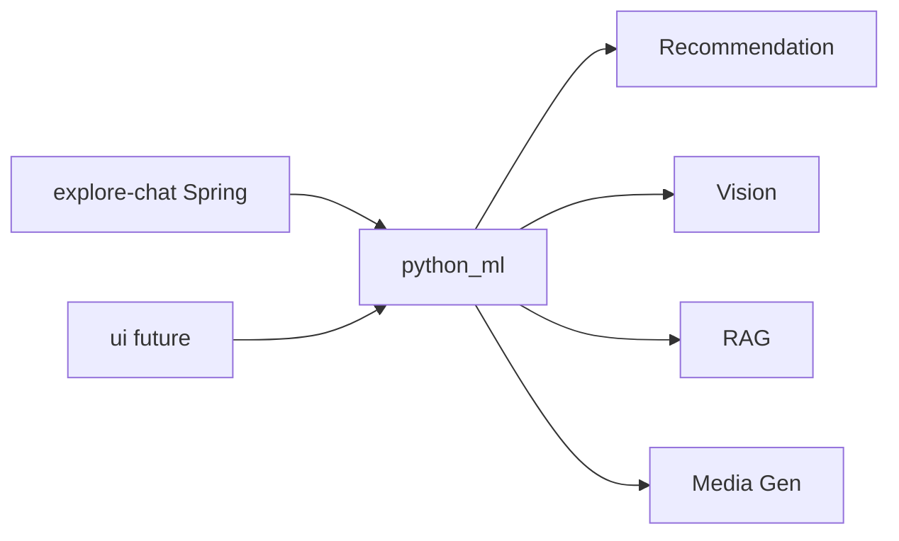

# Glossary | 领域术语表

> Explore ML — Ubiquitous Language（统一语言）

---

## 1. Purpose | 文档说明

This document defines the project **Ubiquitous Language**. English terms are
the **preferred canonical names** and must align with code, API, and
architecture naming. Chinese labels are for localization only.

### Maintenance Principles

1. **Glossary first**: Add or update terms here before implementing code
2. **Code sync**: Domain model changes must update the corresponding entry
3. **Preferred term**: Use the **Preferred Term (English)** column for code,
   API, commits, and technical docs

---

## 2. Business Domains | 业务域总览

| Preferred Term | 中文     | Code / Path                         | HTTP (default) | Notes                          |
| -------------- | -------- | ----------------------------------- | -------------- | ------------------------------ |
| Recommendation | 推荐     | `python_ml/recommendation`          | `:8000`        | Feed / Explore / Reels rank    |
| Vision         | 视觉审核 | `python_ml/vision`                  | `:8001`        | Labels + moderation            |
| RAG            | 检索增强 | `python_ml/rag`                     | `:8002`        | Documents + local Qdrant path  |
| Media Gen      | 媒体生成 | `python_ml/media-gen`               | `:3456`        | Image / video / voice          |
| Model Test UI  | 测模界面 | `ui/`                               | —              | Placeholder; sibling of `python_ml` |
| Fixture Data   | 测试数据 | `data/`                             | —              | Small fixtures only            |

---

## 3. Preferred Terms | 术语表

| Preferred Term   | 中文     | Definition                                                                 |
| ---------------- | -------- | -------------------------------------------------------------------------- |
| Explore ML       | Explore ML | Sibling repo of optional Python FastAPI helpers for Explore products     |
| Loopback Upstream| 旁路上游 | Called only by a sibling API over localhost; never from product clients    |
| AIP REST Surface | AIP REST | `/api/v1` resource or `:verb` paths; snake_case JSON; AIP-193 `RpcStatus`  |
| Fixture Data     | 测试数据 | Committed small files under `data/`; large weights stay gitignored         |

---

## References

- [AIP-121 Resource-oriented design](https://google.aip.dev/121)
- [AIP-193 Errors](https://google.aip.dev/193)
- [FastAPI](https://fastapi.tiangolo.com/)
