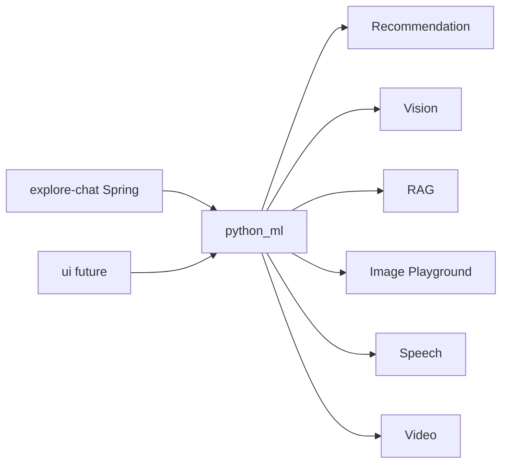

# Glossary | 领域术语表

> Explore ML — Ubiquitous Language（统一语言）

---

## 1. Purpose | 文档说明

This document defines the project **Ubiquitous Language**. English terms are
the **preferred canonical names** and must align with code, API, and
architecture naming. Chinese labels are for localization only.

### Maintenance Principles

1. **Glossary first**: Add or update terms here before implementing code
2. **Code sync**: Domain model changes must update the corresponding entry
3. **Preferred term**: Use the **Preferred Term (English)** column for code,
   API, commits, and technical docs

---

## 2. Business Domains | 业务域总览

| Preferred Term | 中文     | Code / Path                | HTTP (default) | Notes                               |
| -------------- | -------- | -------------------------- | -------------- | ----------------------------------- |
| Recommendation | 推荐     | `python_ml/recommendation` | `:8000`        | Feed / Explore / Reels rank         |
| Vision         | 视觉审核 | `python_ml/vision`         | `:8001`        | Labels + moderation                 |
| RAG            | 检索增强 | `python_ml/rag`            | `:8002`        | Documents + local Qdrant path       |
| Image Playground | 图像游乐场 | `python_ml/image-playground` | `:8003` | Image generation |
| Speech           | 语音       | `python_ml/speech`           | `:8004` | ASR + TTS |
| Video            | 视频生成   | `python_ml/video`            | `:8005` | Video generation |
| Model Test UI  | 测模界面 | `ui/`                      | —              | Placeholder; sibling of `python_ml` |
| Fixture Data   | 测试数据 | `data/`                    | —              | Small fixtures only                 |

---

## 3. Preferred Terms | 术语表

| Preferred Term    | 中文       | Definition                                                              |
| ----------------- | ---------- | ----------------------------------------------------------------------- |
| Explore ML        | Explore ML | Sibling repo of optional Python FastAPI helpers for Explore products    |
| Loopback Upstream | 旁路上游   | Called only by a sibling API over localhost; never from product clients |
| Fixture Data      | 测试数据   | Committed small files under `data/`; large weights stay gitignored      |
| Local Models Root | 本地模型根 | Weight root via `LOCAL_MODELS_ROOT`; obtain checkpoints with the [Model Download Guide](user-guide/model-download.md); Image Playground / Speech / Video and RAG rerank prefer those paths |
| ASR               | 语音识别   | Speech-to-text on Speech (`POST /api/v1/audios:transcribe`); default local Qwen3-ASR after download |

---

## References

- [FastAPI](https://fastapi.tiangolo.com/)
- [Uvicorn](https://docs.uvicorn.org/)
