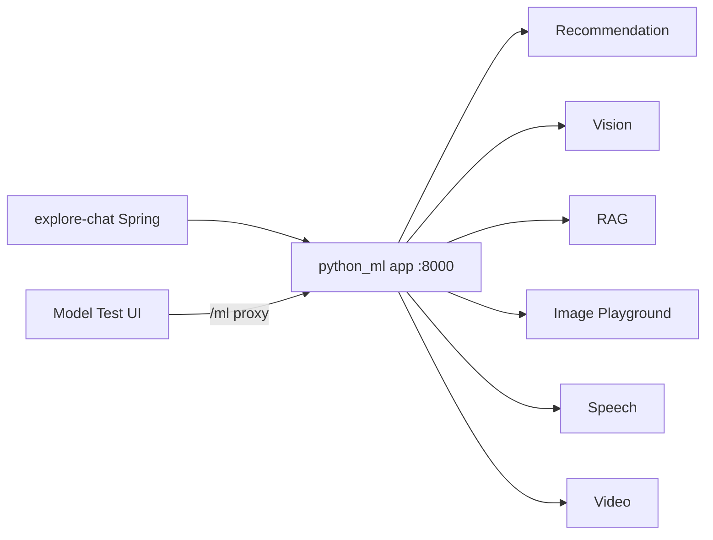

# Glossary | 领域术语表

> Explore ML — Ubiquitous Language（统一语言）

---

## 1. Purpose | 文档说明

This document defines the project **Ubiquitous Language**. English terms are
the **preferred canonical names** and must align with code, API, and
architecture naming. Chinese labels are for localization only.

### Maintenance Principles

1. **Glossary first**: Add or update terms here before implementing code
2. **Code sync**: Domain model changes must update the corresponding entry
3. **Preferred term**: Use the **Preferred Term (English)** column for code,
   API, commits, and technical docs

---

## 2. Business Domains | 业务域总览

Every module is a package in one FastAPI app (`python_ml/main.py`, port
`8000`). `EXPLORE_MODULES` selects which ones load.

| Preferred Term   | 中文       | Code / Path                  | Notes                               |
| ---------------- | ---------- | ---------------------------- | ----------------------------------- |
| Recommendation   | 推荐       | `python_ml/recommendation`   | Feed / Explore / Reels rank         |
| Vision           | 视觉审核   | `python_ml/vision`           | Labels + moderation                 |
| RAG              | 检索增强   | `python_ml/rag`              | Documents + local Qdrant path       |
| Image Playground | 图像游乐场 | `python_ml/image_playground` | Image generation                    |
| Speech           | 语音       | `python_ml/speech`           | ASR + TTS                           |
| Video            | 视频生成   | `python_ml/video`            | Video generation                    |
| Model Test UI    | 测模界面   | `ui/` (`:4200`)              | Angular dev UI; proxies `/ml`       |
| Fixture Data     | 测试数据   | `data/`                      | Small fixtures only                 |

```mermaid
flowchart LR
  siblingApi[explore-chat Spring] --> pyMl[python_ml app :8000]
  testUi[Model Test UI] -->|/ml proxy| pyMl
  pyMl --> rec[Recommendation]
  pyMl --> vis[Vision]
  pyMl --> ragSvc[RAG]
  pyMl --> ip[Image Playground]
  pyMl --> sp[Speech]
  pyMl --> vd[Video]
```

---

## 3. Preferred Terms | 术语表

| Preferred Term    | 中文       | Definition                                                              |
| ----------------- | ---------- | ----------------------------------------------------------------------- |
| Explore ML        | Explore ML | Sibling repo of one optional Python FastAPI app (six modules) for Explore products |
| ML App            | ML 应用    | `python_ml/main.py` → `server.create_app`; mounts every module's routers on one port (`PORT`, default `8000`) |
| Module            | 模块       | Package under `python_ml/` exposing `module.py` (`routers`, optional `lifespan`, `health`, `readiness`, `register_exception_handlers`) |
| Loopback Upstream | 旁路上游   | Called only by a sibling API over localhost; never from product clients |
| Fixture Data      | 测试数据   | Committed small files under `data/`; large weights stay gitignored      |
| Local Models Root | 本地模型根 | Weight root via `LOCAL_MODELS_ROOT` (default `~/Codes/models`); obtain checkpoints with the [Model Download Guide](user-guide/model-download.md); Image Playground, Speech, RAG rerank and the Recommendation feed ranker read it. Video loads the Hugging Face id in `COGVIDEOX_MODEL` instead |
| ASR               | 语音识别   | Speech-to-text on Speech (`POST /api/v1/audios:transcribe`); default local Qwen3-ASR after download |
| Streaming ASR     | 流式识别   | `WS /ws/v1/audios:transcribe`; client sends `audio` / `commit` / `stop`, server answers `partial` / `final` / `error`; buffered by `StreamingTranscriptionSession` |
| TTS               | 语音合成   | Text-to-speech on Speech (`POST /api/v1/voices:synthesize`); returns `audio_url` directly (`.wav` with Qwen, `.mp3` with Edge) |
| ML Proxy          | ML 代理    | `ng serve` route `/ml` → the ML app on loopback (prefix stripped, WebSocket on); target overridable via `EXPLORE_ML_URL` |
| Module Page       | 模块页     | One UI page per module (`#/<id>`) with a card for every endpoint and D3 charts of its results |
| Chart             | 图表       | D3 component in `ui/src/app/shared/` (bar, line, slope, histogram, scatter, job timeline, waveform); math lives in `chart-math.ts` |
| Health Report     | 健康报告   | `GET /health` → `{status: ok \| degraded, modules: {name: {status, latency_ms, …}}}`; `/health/live` and `/health/ready` (503 lists not-ready modules) |

---

## 4. Domain Terms by Module | 各模块领域术语

Each term is a class or constant in the module's `domain/` (or `service/` /
`infra/` where noted). Services are `XService` classes provided by an
`@lru_cache` `get_x_service()` function.

### RAG (`python_ml/rag`)

| Preferred Term     | 中文       | Code                              | Definition |
| ------------------ | ---------- | --------------------------------- | ---------- |
| Chunk              | 文本块     | `domain/chunker.py` `Chunk`       | Token-bounded slice of a document with id, text and metadata |
| Text Chunker       | 分块器     | `domain/chunker.py` `TextChunker` | Splits text or PDF pages into chunks (`CHUNK_SIZE`, `CHUNK_OVERLAP`) |
| Chunk Indexer      | 块索引器   | `service/indexing.py` `ChunkIndexer` | Embeds chunks in batches of 10 and upserts them into one collection |
| Collection         | 集合       | `domain/query.py` `SEARCHABLE_COLLECTIONS` | Qdrant collections `documents`, `posts`, `comments`, `webpages` |
| Search Hit         | 检索命中   | `domain/query.py` `SearchHit`     | One retrieved chunk: id, score, payload |
| Answer             | 回答       | `domain/query.py` `Answer`        | LLM text plus source hits, chunks searched and generation time |
| Rerank Sidecar     | 重排旁路   | `infra/reranker.py`               | Optional HTTP reranker (`RERANK_URL`); rescores `top_k * 3` candidates |
| Exported Vectors   | 导出向量   | `domain/query.py` `ExportedVectors` | Stored chunk vectors for `documents:exportVectors`; `dimension` 0 when empty |
| Indexed Document   | 已索引文档 | `domain/document.py` `IndexedDocument` | Result of an upload: id, filename, size, chunk count |
| Scraped Webpage    | 已抓取网页 | `domain/webpage.py` `ScrapedWebpage` | Result of one scrape; `status` is `completed` or `error: ...` |
| Sync Result        | 同步结果   | `domain/sync.py` `SyncResult`     | Totals for a posts / comments sync from the content API |
| Domain Error       | 领域错误   | `domain/errors.py`                | `InvalidRequestError` 400, `NotFoundError` 404, `ServiceUnavailableError` 503, `UpstreamError` upstream status |

### Vision (`python_ml/vision`)

| Preferred Term      | 中文     | Code                                    | Definition |
| ------------------- | -------- | --------------------------------------- | ---------- |
| Prediction          | 预测     | `domain/prediction.py` `Prediction`         | One label with its softmax score; `top_unique` keeps the best per label |
| Moderation Category | 审核类别 | `domain/moderation.py` `ModerationCategory` | One flagged label with its score |
| Frame Verdict       | 帧结论   | `domain/moderation.py` `FrameVerdict`       | One sampled video frame: `offset_seconds`, category scores, `safe` |
| Moderation Verdict  | 审核结论 | `domain/moderation.py` `ModerationVerdict`  | `safe` flag, flagged categories, every category's score (peak over frames for video) and the frames |

### Image Playground and Video

| Preferred Term | 中文     | Code                       | Definition |
| -------------- | -------- | -------------------------- | ---------- |
| Job            | 生成任务 | `domain/job.py` `Job`      | One generation request: id, status, url, error |
| Job Status     | 任务状态 | `domain/job.py` `JobStatus` | `pending`, `succeeded` or `failed` |
| Job Store      | 任务存储 | `domain/job.py` `JobStore` | In-memory store of jobs for polling (`imageJobs/{id}`, `videoJobs/{id}`) |
| LoRA Adapter   | LoRA 适配器 | `infra/pipeline.py` `LORA_ADAPTER_NAME` | Image Playground loads `IMAGE_LORA_PATH` as adapter `fine_tuned` |

### Recommendation (`python_ml/recommendation`)

| Preferred Term   | 中文     | Code                                   | Definition |
| ---------------- | -------- | -------------------------------------- | ---------- |
| Rank             | 排序     | `feeds:rank`, `explores:rank`, `reels:rank` | Score caller-supplied candidates with the feed ranker; score 1.0 when no model is loaded |
| Recall           | 召回     | `feeds:recall`                          | Nearest items for a user from the vector store |
| Feature Registry | 特征注册 | `domain/feature_registry.py`            | Named feature definitions shared by training and serving |
| Vector Store     | 向量存储 | `domain/vector_store.py` `VectorStore`  | Interface implemented by Redis and Faiss stores in `infra/` |

---

## References

- [FastAPI](https://fastapi.tiangolo.com/)
- [Uvicorn](https://docs.uvicorn.org/)
