# Guideline

Machine learning in `explore-ml` helps sibling Explore products rank feeds,
moderate media, ground answers in documents, and generate image, video, and
speech—when those outcomes are clear and measurable. Use it to enrich product
APIs without shipping opaque, untestable model stacks inside every service.

## Introduction

This guideline describes how to design Recommendation, Vision, RAG, and Media
Gen (image, video, TTS, ASR) in `explore-ml`. Prefer official documentation,
open protocols, and primary research when changing model behavior. Product
vocabulary lives in the [Glossary](Glossary.md); architecture boundaries live
in the [C4 model](developer/c4-model/); runbooks live in the
[User guide](user-guide/README.md); obtaining checkpoints lives in
[Model download](user-guide/model-download.md).

Diagrams below show **target best practices** for the easiest integration and
configuration. They are independent of today’s package layout; align code to
these shapes over time.

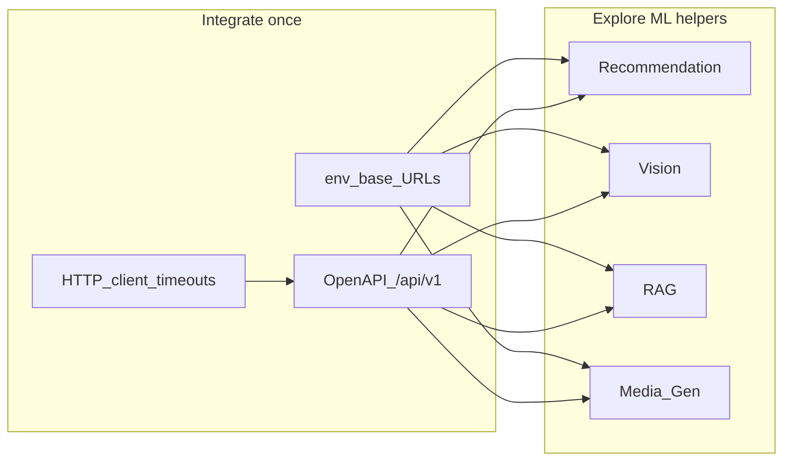

Prefer one base URL per helper, one `.env` / YAML block on the product API, and
stable `/api/v1` custom methods. Call helpers only over loopback from the
server—never from browsers.

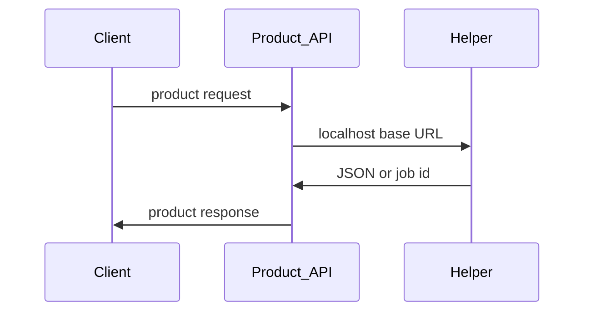

## Best practices

### Two-stage ranking

**Separate candidate generation from ranking.** Industrial recommenders usually
retrieve a wide set first, then score a short list. Do not force one model to
do both recall and fine ranking. See
[Deep Neural Networks for YouTube Recommendations](https://research.google.com/pubs/pub45530/)
and [FAISS](https://arxiv.org/abs/1702.08734).

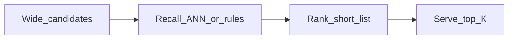

Expose recall and rank as separate HTTP methods when both are needed. Wire the
product API to call rank on a short list you already hold.

### Grounded generation

**Ground generation in retrieved evidence.** For RAG, embed → recall →
(optional) rerank → generate. Answers should cite retrieved chunks; do not
treat the LLM as a closed-book knowledge base. Classic framing:
[Retrieval-Augmented Generation](https://arxiv.org/abs/2005.11401).

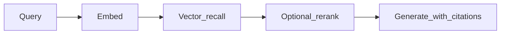

Configure embedding, store, and LLM URLs once. Keep rerank optional so a down
sidecar never blocks the whole answer path.

### Local checkpoints

**Default to local checkpoints; keep backends swappable.** Media Gen and RAG
prefer downloaded weights under `LOCAL_MODELS_ROOT` (see the
[download guide](user-guide/model-download.md)). Operators may switch to HF ids,
Stable Diffusion, edge-tts, or cloud embeddings without changing each API’s ML
contract.

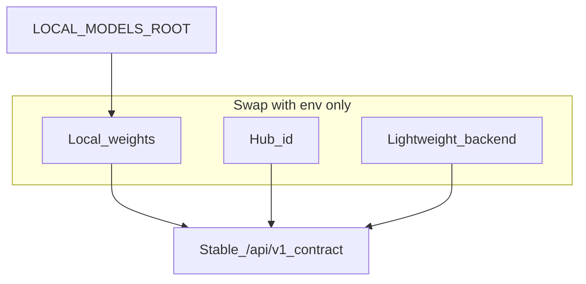

Set `LOCAL_MODELS_ROOT` once. Change `IMAGE_BACKEND`, `VOICE_BACKEND`, or model
ids without renaming routes.

### Offline training and inference

**Keep training and heavy inference off the request path when possible.** Batch
ETL, tower training, and large diffusion / TTS / ASR warm-ups belong in jobs or
lazy-loaded workers. HTTP handlers should enqueue work or serve precomputed
scores when the workload is long-running.

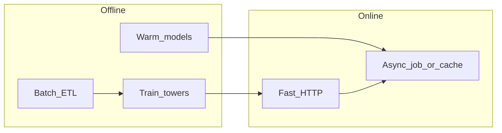

### Evaluation

**Score quality with metrics and fixtures, not anecdotes.** Ranking needs
offline metrics (for example AUC, NDCG) and engagement labels. RAG needs
retrieval hit-rate plus grounded answer checks. Generative and speech paths
need smoke prompts and small fixtures under `data/`. Readings:
[Judging LLM-as-a-Judge](https://arxiv.org/abs/2306.05685).

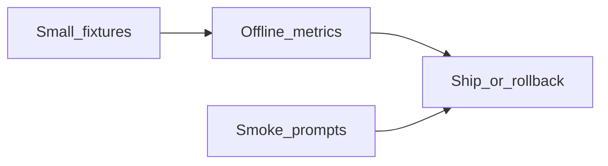

### Resource bounds

**Bound inputs and device memory.** Cap image size, video frame counts, ASR
uploads, and diffusion steps. Auto-select CUDA / MPS / CPU; allow forcing CPU.
Fail clearly when weights are missing instead of hanging on download inside a
hot request.

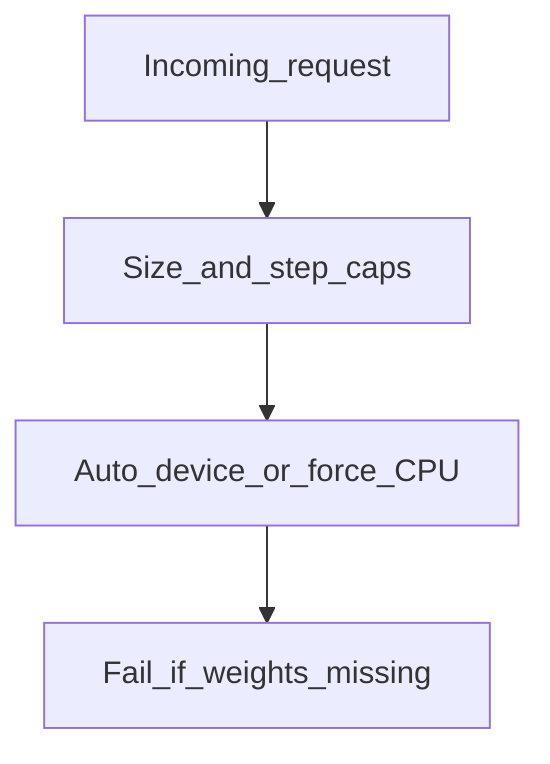

## Protocols and platform APIs

### HTTP and OpenAPI

**Expose helpers as documented HTTP APIs on FastAPI.** Prefer stable `/api/v1`
resource and custom-method shapes (for example `images:generate`,
`audios:transcribe`). Publish OpenAPI from the running app (`/docs`). See
[FastAPI](https://fastapi.tiangolo.com/),
[OpenAPI Specification](https://spec.openapis.org/oas/latest.html), and
[Google AIP-136](https://google.aip.dev/136).


Configure one upstream string per helper. Discover request bodies from `/docs`
instead of hard-coding ad-hoc clients.

### Easiest product wiring

**Prefer four env vars and timeouts—nothing else for first connect.**

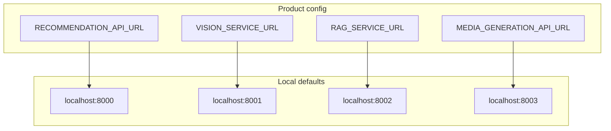

Own connect timeouts and fallbacks in the product API. Degrade the feature when
a helper is down; do not hang the main request forever.

### Server-Sent Events

**Stream long RAG answers when progress matters.** Keep SSE event shapes
stable. See
[WHATWG Server-Sent Events](https://html.spec.whatwg.org/multipage/server-sent-events.html).

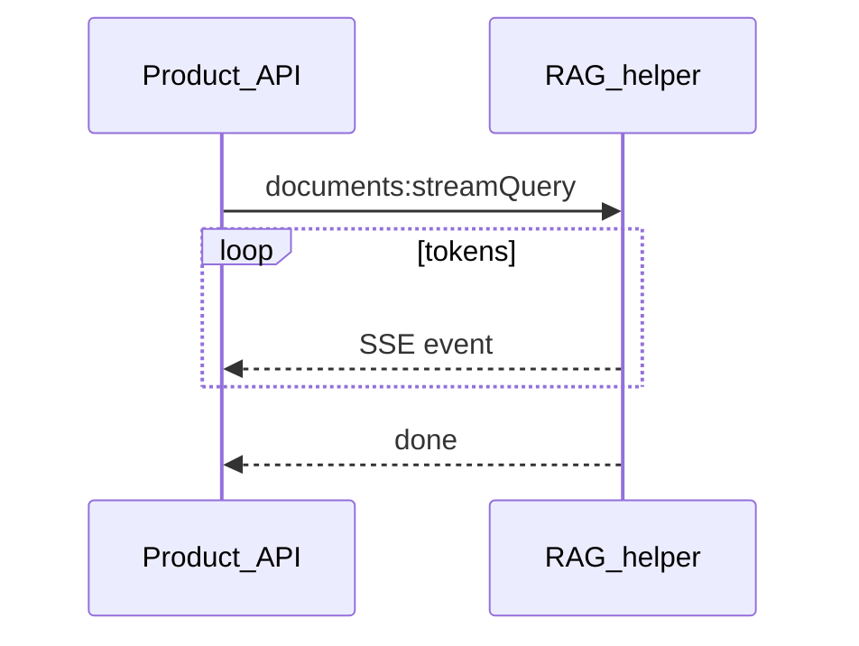

### Model libraries

**Load generative and speech models through documented libraries.** Image and
video: [Diffusers](https://huggingface.co/docs/diffusers/index). ASR, TTS, and
rerankers: [Transformers](https://huggingface.co/docs/transformers). Discover
weights on [Hugging Face Hub](https://huggingface.co/docs/hub/index) or
[ModelScope](https://www.modelscope.cn/). Prefer
[Safetensors](https://huggingface.co/docs/safetensors/index) over pickle
weights.

### Vector store

**Store dense vectors in a purpose-built vector database.** Default local path
uses [Qdrant](https://qdrant.tech/documentation/). ANN lineage:
[FAISS](https://arxiv.org/abs/1702.08734).

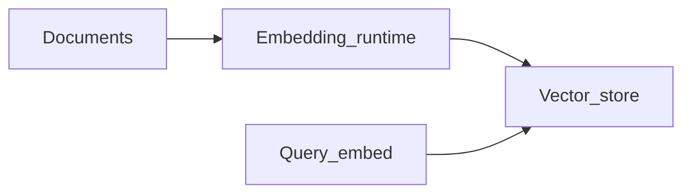

Point embedding and Qdrant URLs through env. Re-ingest after any embedding
model change.

### Local LLM runtimes

**Configure local LLMs and embeddings through Ollama when that is the contract.**
See [Ollama](https://github.com/ollama/ollama). Cloud embeddings and chat
remain optional via documented OpenAI-compatible APIs when enabled.

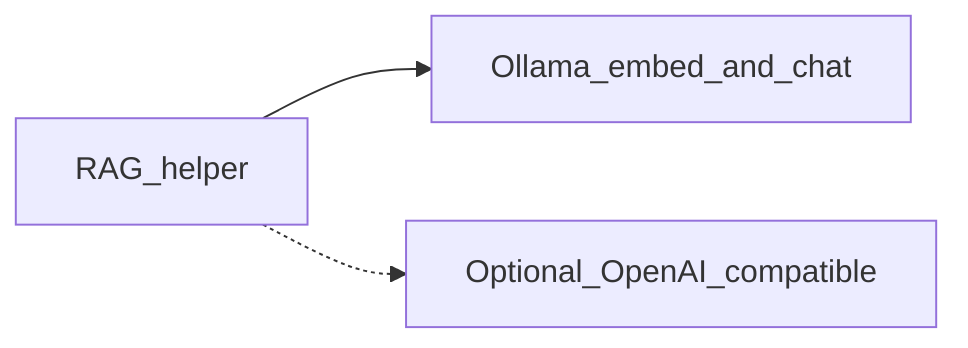

## Recommendation

### Collaborative filtering and factorization

**Start from collaborative filtering and factorization, then deepen.**
Item–item and matrix factorization remain strong baselines
([Item-based Collaborative Filtering](https://dl.acm.org/doi/10.1145/371920.372071),
[Matrix Factorization Techniques for Recommender Systems](https://dl.acm.org/doi/10.1109/MC.2009.263)).
Wide-and-deep and deep models combine memorization with generalization
([Wide & Deep](https://arxiv.org/abs/1606.07792),
[DLRM](https://arxiv.org/abs/1906.00091)).

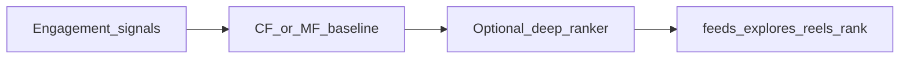

### Sequential recommendation

**Use sequential signals for short-horizon next-item (for example Reels).**
Session recommenders such as [GRU4Rec](https://arxiv.org/abs/1511.06939) and
[SASRec](https://arxiv.org/abs/1808.09781) inform architectures beyond static
user towers.

### Graph recall

**Treat social graph edges as recall features when available.** Follow graphs
support discovery beyond hand-tuned rules
([DeepWalk](https://arxiv.org/abs/1403.6652)). Keep expensive graph ETL offline
from serving; prefer precomputed suggestions on the request path.

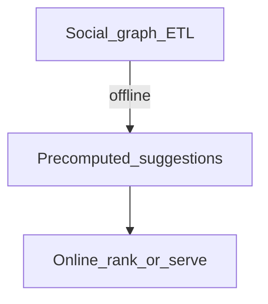

## Vision

### Classification and moderation

**Keep classification labels distinct from moderation decisions.** A
ResNet-style classifier answers what appears in an image
([Deep Residual Learning](https://arxiv.org/abs/1512.03385)); thresholds answer
whether it may publish. Do not conflate ImageNet Top-K with policy outcomes.

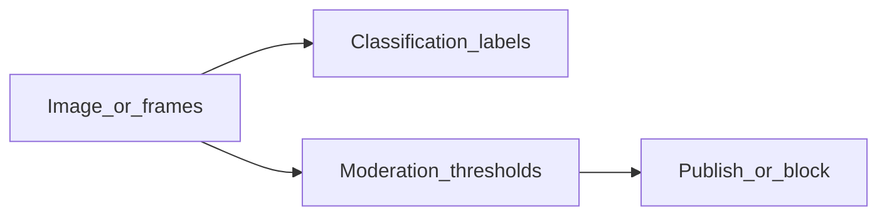

Expose `images:predict` and `images:moderate` as separate methods. Configure
thresholds in env—not in the client.

### Video sampling

**Sample video sparsely for moderation.** Bound frame counts and intervals so
CPU / MPS throughput stays predictable.

### Model packaging

**Prefer portable packaging when exporting vision models.** See
[ONNX](https://onnx.ai/) and [ONNX Runtime](https://onnxruntime.ai/). Keep
input size and timeouts explicit in configuration.

## Retrieval-augmented generation

### Retrieval and generation

**Keep retrieval and generation separate.** Retrieve chunks, optionally
rerank, then generate with grounded context
([Retrieval-Augmented Generation](https://arxiv.org/abs/2005.11401)).

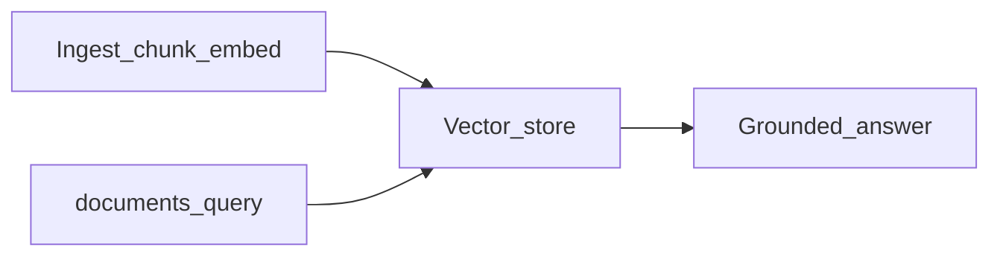

### Embedding spaces

**Do not mix embedding spaces.** After changing an embedding model, re-ingest
documents. Vector dimensions and model identity must match the store schema.
See [Qwen3 Embedding](https://qwenlm.github.io/blog/qwen3-embedding/).

### Reranking

**Widen recall, then rerank for precision.** Cross-encoder and LLM-style
rerankers improve the short list
([Passage Re-ranking with BERT](https://arxiv.org/abs/1901.04085)). If the
rerank sidecar is unavailable, keep vector order—do not fail the whole query.

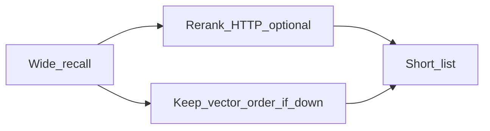

Enable rerank with one URL and a model path. Disable with a single flag when
the sidecar is absent.

### Corpus readiness

**Mark corpora ready only after chunking and embedding.** Do not pretend Q&A
is available while indexing is incomplete. Keep chunk size within the embedding
model’s practical context.

## Media generation and speech

### Diffusion

**Align image and video synthesis with diffusion methods.** Lineage:
[Latent Diffusion Models](https://arxiv.org/abs/2112.10752),
[DDPM](https://arxiv.org/abs/2006.11239). Treat heavy jobs as asynchronous:
return a job id and poll. Prefer downloaded local weights (for example
Qwen-Image via Diffusers); allow Hugging Face ids via configuration.

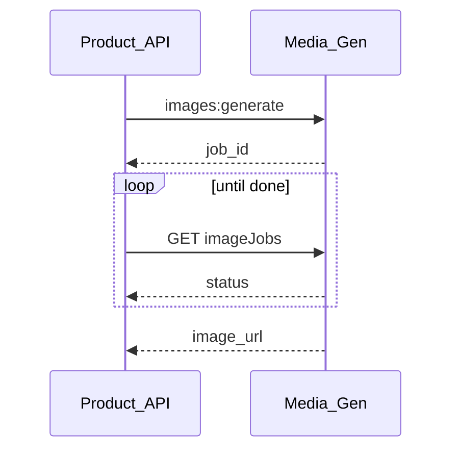

### Text-to-speech

**Keep TTS on an explicit synthesize route.** Default to local Qwen3-TTS after
the download guide; edge-tts remains a lightweight non-local backend. Keep
formats aligned (`.wav` vs `.mp3`).

### Automatic speech recognition

**Keep ASR on an explicit transcribe route.** Lineage:
[Whisper](https://arxiv.org/abs/2212.04356). Default to local Qwen3-ASR
(`audios:transcribe`). Do not mix incompatible contracts across TTS, ASR,
diffusion image, and video.

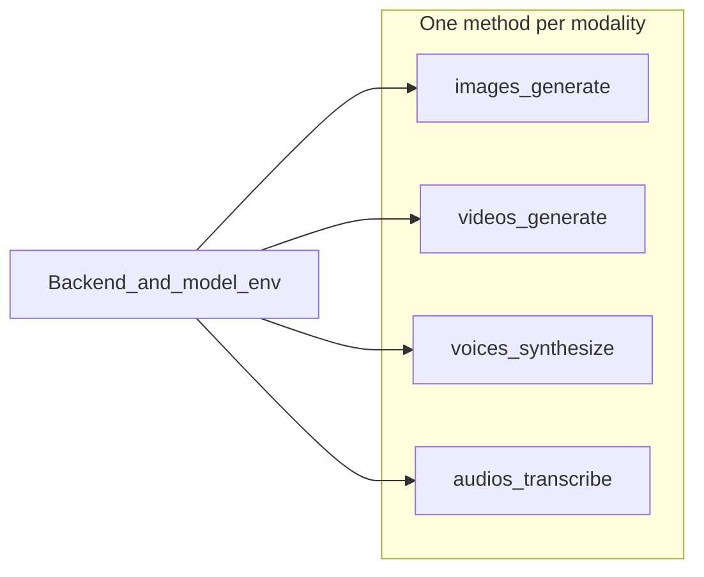

### Device and dtype

**Match dtype and device deliberately.** Use `float16` / `bfloat16` on GPU or
MPS and `float32` on CPU when required. Enable MPS fallback where needed.
Document platforms that skip local video unless forced.

## Models and local runtimes

### Shared vocabulary

**Treat deep learning building blocks as shared vocabulary.** Transformers
([Attention Is All You Need](https://arxiv.org/abs/1706.03762)); residual CNNs
for vision; diffusion for pixels; ASR/TTS stacks for speech.

### Open models

**Prefer documented open models and stable packaging.** Discover models on
[Hugging Face](https://huggingface.co/) and
[ModelScope](https://www.modelscope.cn/); scan new work on
[arXiv cs.LG](https://arxiv.org/list/cs.LG/recent) and
[arXiv cs.IR](https://arxiv.org/list/cs.IR/recent). Qwen families:
[Qwen](https://qwen.ai/).

### Weight formats

**Prefer Safetensors and documented Diffusers layouts for generative weights.**
Avoid untrusted pickle checkpoints. Ollama manages LLM packaging separately
from `LOCAL_MODELS_ROOT`. Commit only small Fixture Data under `data/`.

```mermaid
flowchart TB
  subgraph git [In git]
    Fixtures[data_fixtures]
  end
  subgraph disk [On disk]
    Root[LOCAL_MODELS_ROOT]
    OllamaHome[Ollama_home]
  end
  Fixtures -.->|"small only"| Root
  Root --> Media[Media_Gen_and_rerank]
  OllamaHome --> RAG[RAG_LLM_embed]
```

### Cold start

**Make cold start and missing weights visible.** First load of ASR, TTS,
diffusion, or rerank may be slow. Fail clearly when paths are empty rather
than blocking on an unexpected multi-gigabyte pull.

```mermaid
flowchart LR
  Start[First_request]
  Warm[Lazy_load_weights]
  Ready[Serve]
  Empty[Clear_error_if_missing]
  Start --> Warm --> Ready
  Start --> Empty
```

## Resources

### Related

[Attention Is All You Need](https://arxiv.org/abs/1706.03762)

[Item-based Collaborative Filtering](https://dl.acm.org/doi/10.1145/371920.372071)

[Matrix Factorization Techniques for Recommender Systems](https://dl.acm.org/doi/10.1109/MC.2009.263)

[Deep Neural Networks for YouTube Recommendations](https://research.google.com/pubs/pub45530/)

[Wide & Deep Learning for Recommender Systems](https://arxiv.org/abs/1606.07792)

[DLRM](https://arxiv.org/abs/1906.00091)

[GRU4Rec](https://arxiv.org/abs/1511.06939)

[SASRec](https://arxiv.org/abs/1808.09781)

[DeepWalk](https://arxiv.org/abs/1403.6652)

[FAISS](https://arxiv.org/abs/1702.08734)

[Deep Residual Learning for Image Recognition](https://arxiv.org/abs/1512.03385)

[Retrieval-Augmented Generation](https://arxiv.org/abs/2005.11401)

[Passage Re-ranking with BERT](https://arxiv.org/abs/1901.04085)

[Denoising Diffusion Probabilistic Models](https://arxiv.org/abs/2006.11239)

[High-Resolution Image Synthesis with Latent Diffusion Models](https://arxiv.org/abs/2112.10752)

[Whisper](https://arxiv.org/abs/2212.04356)

[Judging LLM-as-a-Judge](https://arxiv.org/abs/2306.05685)

[OpenAPI Specification](https://spec.openapis.org/oas/latest.html)

[Google AIP-136 Custom methods](https://google.aip.dev/136)

[WHATWG Server-Sent Events](https://html.spec.whatwg.org/multipage/server-sent-events.html)

[Safetensors](https://huggingface.co/docs/safetensors/index)

[ONNX](https://onnx.ai/)

[Hugging Face Hub](https://huggingface.co/docs/hub/index)

[Qwen3 Embedding](https://qwenlm.github.io/blog/qwen3-embedding/)

[arXiv cs.LG](https://arxiv.org/list/cs.LG/recent)

[arXiv cs.IR](https://arxiv.org/list/cs.IR/recent)

### Developer documentation

[FastAPI](https://fastapi.tiangolo.com/)

[Diffusers](https://huggingface.co/docs/diffusers/index)

[Transformers](https://huggingface.co/docs/transformers)

[Qdrant documentation](https://qdrant.tech/documentation/)

[Ollama](https://github.com/ollama/ollama)

[ONNX Runtime](https://onnxruntime.ai/)

[ModelScope](https://www.modelscope.cn/)

[Qwen-Image](https://huggingface.co/Qwen/Qwen-Image)

[Qwen3-ASR-1.7B](https://huggingface.co/Qwen/Qwen3-ASR-1.7B)

[Qwen3-TTS-12Hz-1.7B-CustomVoice](https://huggingface.co/Qwen/Qwen3-TTS-12Hz-1.7B-CustomVoice)

[Qwen3-Reranker-8B](https://huggingface.co/Qwen/Qwen3-Reranker-8B)

[Glossary](Glossary.md)

[User guide](user-guide/README.md)

[Model download](user-guide/model-download.md)

[C4 model](developer/c4-model/)
