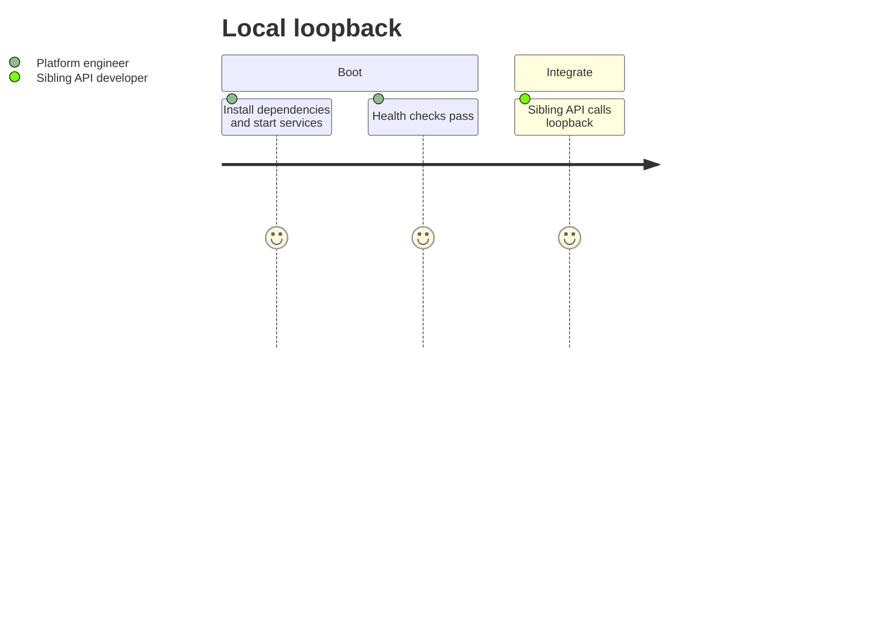

# User Story Map

> Index page. ML helpers are consumed by sibling APIs; product users never
> call these ports directly.

## Personas

| Role | Description |
| ---- | ----------- |
| Platform engineer | Starts loopback helpers locally and mounts fixture data |
| Sibling API developer | Calls recommendation / vision / rag / media-gen over loopback |
| Model-test engineer (planned) | Exercises models and health checks via a future `ui/` |

## Journey overview

### Local loopback

## Epic index (planned)

| Epic | Status | Notes |
| ---- | ------ | ----- |
| E1 | In progress | Four services available on separate ports |
| E2 | Planned | Converge behind one port (still under `python_ml/`) |
| E3 | Planned | `ui/` model-test front end |
