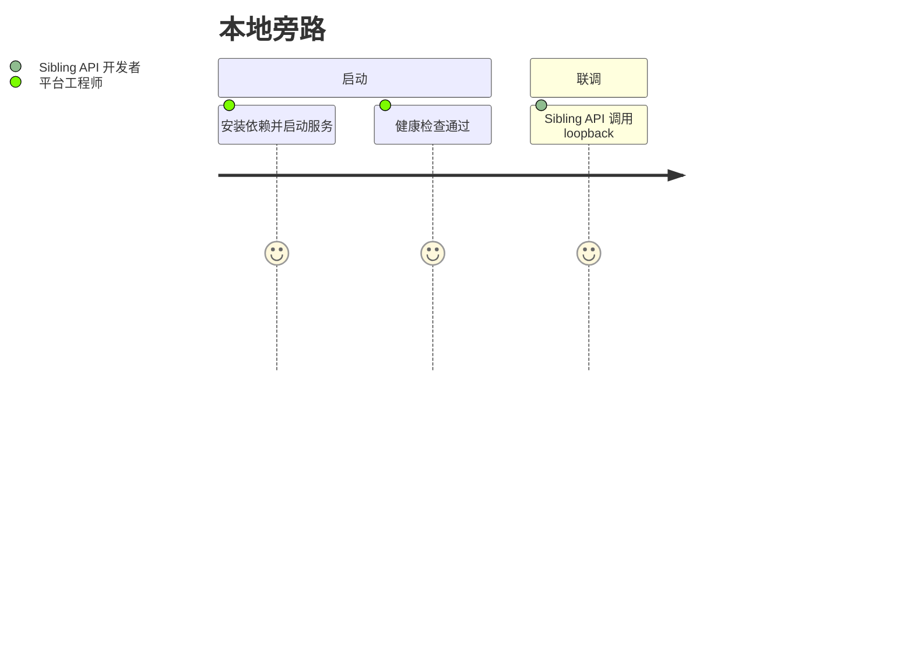

# 用户故事地图

> 索引页。ML helpers 由 sibling API 消费；产品用户不直连这些端口。

## 用户画像

| 角色                | 说明                                              |
| ------------------- | ------------------------------------------------- |
| 平台工程师          | 本地启动旁路服务、对齐 AIP、挂载 fixture 数据     |
| Sibling API 开发者  | 经 loopback 调用 recommendation / vision / rag / media-gen |
| 测模工程师（规划）  | 经未来 `ui/` 试跑模型与健康检查                   |

## 旅程总览

### 本地旁路

## Epic 索引（规划）

| Epic | 状态   | 说明                         |
| ---- | ------ | ---------------------------- |
| E1   | 进行中 | 四服务分端口可用             |
| E2   | 规划   | 单端口收敛（仍在 `python_ml/`） |
| E3   | 规划   | `ui/` 测模前端               |
