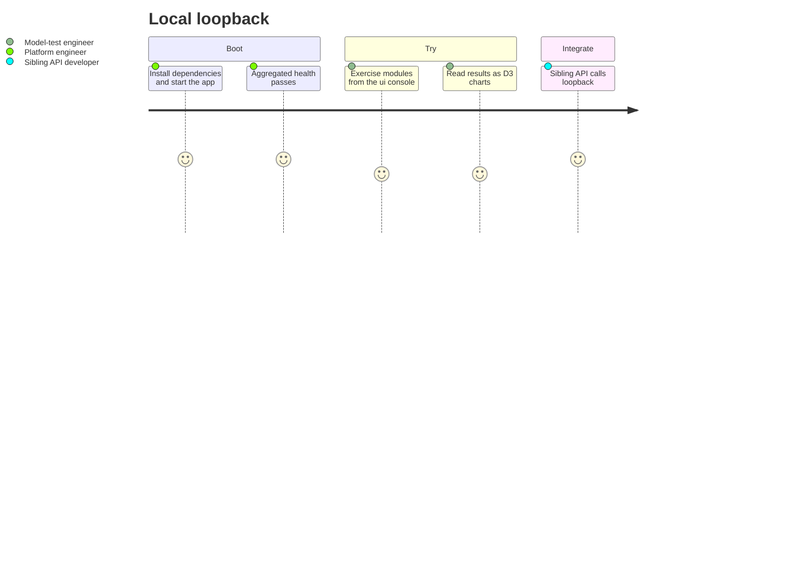

# User Story Map

> Index page. The ML app is consumed by sibling APIs; product users never
> call its port directly.

## Personas

| Role | Description |
| ---- | ----------- |
| Platform engineer | Starts the loopback ML app locally and mounts fixture data |
| Sibling API developer | Calls recommendation / vision / rag / image_playground / speech / video routes on one base URL |
| Model-test engineer | Exercises each module from the `ui/` operator console on :4200 |

## Journey overview

### Local loopback

```mermaid
journey
    title Local loopback
    section Boot
        Install dependencies and start the app: 5: Platform engineer
        Aggregated health passes: 5: Platform engineer
    section Try
        Exercise modules from the ui console: 4: Model-test engineer
        Read results as D3 charts: 4: Model-test engineer
    section Integrate
        Sibling API calls loopback: 5: Sibling API developer
```

Health means `GET /health` on port 8000: one entry per loaded module with
`status` (`ok`, `degraded` or `error`) and `latency_ms`.

## Epic index

| Epic | Status | Notes |
| ---- | ------ | ----- |
| E1 | Done | Six services on separate ports (8000–8005) |
| E2 | Done | One FastAPI app on port 8000 (modules under `python_ml/`, `EXPLORE_MODULES`) |
| E3 | Done | `ui/` model-test front end with one page per module |

## Delivered stories

| Story | Epic | Status |
| ----- | ---- | ------ |
| Flat per-module layout (`controller/`, `service/`, `domain/`, `infra/`) | E1 | Done |
| RAG export vectors (`documents:exportVectors`) | E1 | Done |
| Streaming ASR over WebSocket (`/ws/v1/audios:transcribe`) | E1 | Done |
| Fine-tuning scripts (`training/` in every module except video) | E1 | Done |
| Single app, aggregated `/health`, one requirements and `.env.example` | E2 | Done |
| Vision prediction scores and per-frame video moderation | E2 | Done |
| UI single `/ml` proxy and per-module health | E2 | Done |
| UI module pages: recommendation, vision, RAG, image, speech, video | E3 | Done |
| D3 charts on every module page | E3 | Done |
| Embedding atlas in `ui/` (PCA scatter on the RAG page) | E3 | Done |
| Eval dashboard in `ui/` | E3 | Planned |
