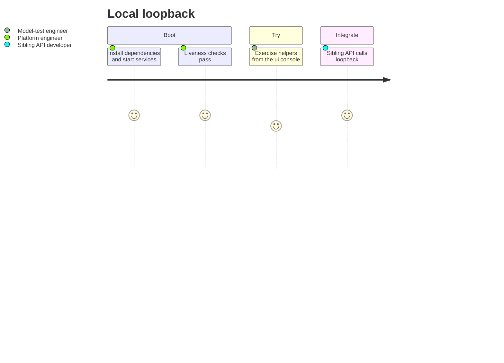

# User Story Map

> Index page. ML helpers are consumed by sibling APIs; product users never
> call these ports directly.

## Personas

| Role | Description |
| ---- | ----------- |
| Platform engineer | Starts loopback helpers locally and mounts fixture data |
| Sibling API developer | Calls recommendation / vision / rag / image-playground / speech / video over loopback |
| Model-test engineer | Exercises each helper from the `ui/` operator console on :4200 |

## Journey overview

### Local loopback

```mermaid
journey
    title Local loopback
    section Boot
        Install dependencies and start services: 5: Platform engineer
        Liveness checks pass: 5: Platform engineer
    section Try
        Exercise helpers from the ui console: 4: Model-test engineer
    section Integrate
        Sibling API calls loopback: 5: Sibling API developer
```

Liveness means `GET /health` on recommendation, vision and RAG, and
`GET /openapi.json` on image playground, speech and video, which have no
health route yet.

## Epic index

| Epic | Status | Notes |
| ---- | ------ | ----- |
| E1 | Done | Six services on separate ports (8000–8005) |
| E2 | Planned | Converge behind one port (still under `python_ml/`) |
| E3 | Done | `ui/` model-test front end with one page per helper |

## Delivered stories

| Story | Epic | Status |
| ----- | ---- | ------ |
| Flat per-helper layout (`controller/`, `service/`, `domain/`, `infra/`) | E1 | Done |
| RAG export vectors (`documents:exportVectors`) | E1 | Done |
| Streaming ASR over WebSocket (`/ws/v1/audios:transcribe`) | E1 | Done |
| Fine-tuning scripts (`training/` in every helper except video) | E1 | Done |
| UI module pages: recommendation, vision, RAG, image, speech, video | E3 | Done |
| Embedding atlas in `ui/` | E3 | Planned |
| Eval dashboard in `ui/` | E3 | Planned |
