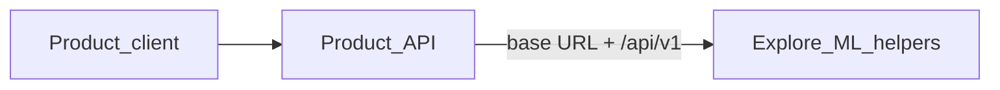
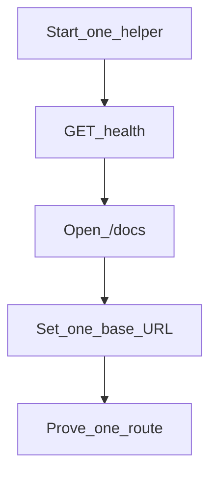

# User guide

Run only the Explore ML helpers you need. Point your product API at one base
URL per helper. Prefer the smallest path that proves one feature end to end.

Diagrams and steps below are **target best practices** for easy integration and
configuration. They are independent of today’s package layout; align
implementation to them over time.

For design rules see the [Guideline](../Guideline.md). For terms see the
[Glossary](../Glossary.md).

## Goal

Four optional helpers. One base URL each. Loopback only from your product API.
Product clients never dial the helpers.



## Get started

1. Start the smallest helper set you need (see
   [Operator setup](operator-setup.md)).
2. Confirm health on that base URL:

```bash
curl -s "$HELPER/health"
```

3. Open `$HELPER/docs` and copy one request from OpenAPI.
4. Set one env var on the product API to `$HELPER` (see
   [Loopback integration](loopback-integration.md)).
5. Call the same route through the product API once.

Download checkpoints only when a local Media Gen or rerank backend needs them
([Model download](model-download.md)). Skip downloads when you use a
lightweight or Hub-backed backend.

Use `$HELPER` as a placeholder. Local defaults are often:

- Recommendation — `http://localhost:8000`
- Vision — `http://localhost:8001`
- RAG — `http://localhost:8002`
- Media Gen — `http://localhost:8003`



## Useful endpoints

Relative to each helper base URL (target contract):

- Health — `GET /health`
- Contract — `GET /docs`
- Recommendation — `POST /api/v1/feeds:rank`, `explores:rank`, `reels:rank`,
  `feeds:recall`
- Vision — `POST /api/v1/images:predict`, `images:moderate`, `videos:moderate`
- RAG — `POST /api/v1/documents`, `documents:query`, `documents:streamQuery`
- Media Gen — `POST /api/v1/images:generate`, `voices:synthesize`,
  `audios:transcribe`, `videos:generate`

Prefer `/docs` over memorizing bodies. Keep custom-method names stable when
code moves.

## Next steps

### Run helpers

**Follow [Operator setup](operator-setup.md).** One process, one port, one
health check.

### Connect your API

**Follow [Loopback integration](loopback-integration.md).** Four env vars at
most for a full stack; one var for a single feature.

### Fetch checkpoints

**Follow [Model download](model-download.md).** Only when local weights are the
chosen backend.

## Related

[Operator setup](operator-setup.md)

[Loopback integration](loopback-integration.md)

[Model download](model-download.md)

[Guideline](../Guideline.md)

[Glossary](../Glossary.md)
