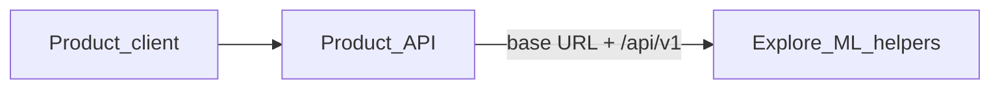
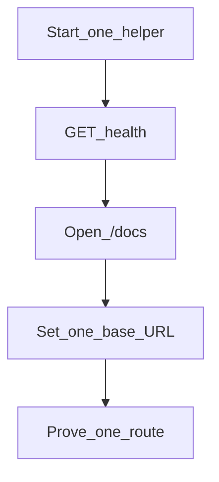

# User guide

Run only the Explore ML helpers you need. Point your product API at one base
URL per helper. Prefer the smallest path that proves one feature end to end.

Diagrams and steps below are **target best practices** for easy integration and
configuration. They are independent of today’s package layout; align
implementation to them over time.

For design rules see the [Guideline](../Guideline.md). For terms see the
[Glossary](../Glossary.md).

## Goal

Six optional helpers. One base URL each. Loopback only from your product API.
Product clients never dial the helpers.


```mermaid
flowchart LR
  Client[Product_client]
  API[Product_API]
  ML[Explore_ML_helpers]
  Client --> API
  API -->|"base URL + /api/v1"| ML
```

## Get started

1. Start the smallest helper set you need (see
   [Operator setup](operator-setup.md)).
2. Confirm health on that base URL:

```bash
curl -s "$HELPER/health"         # recommendation, vision, RAG
curl -s "$HELPER/openapi.json"   # image playground, speech, video
```

   Recommendation and vision serve `/health`. RAG serves `/health`,
   `/health/live` and `/health/ready`. Image Playground, Speech and Video
   have no health route yet; a 200 from `/openapi.json` means the process is
   up.

3. Open `$HELPER/docs` and copy one request from OpenAPI.
4. Set one env var on the product API to `$HELPER` (see
   [Loopback integration](loopback-integration.md)).
5. Call the same route through the product API once.

Download checkpoints only when a local Speech / Image Playground / Video or rerank backend needs them
([Model download](model-download.md)). Skip downloads when you use a
lightweight or Hub-backed backend.

Use `$HELPER` as a placeholder. Local defaults are often:

- Recommendation — `http://localhost:8000`
- Vision — `http://localhost:8001`
- RAG — `http://localhost:8002`
- Image Playground — `http://localhost:8003`
- Speech — `http://localhost:8004`
- Video — `http://localhost:8005`

The Angular operator console in `ui/` runs on `http://localhost:4200` and
proxies `/svc/<id>` to these helpers. Use it to try each helper by hand
before you wire your own API.


```mermaid
flowchart TB
  Start[Start_one_helper]
  Health[GET_health]
  Docs[Open_/docs]
  Env[Set_one_base_URL]
  Prove[Prove_one_route]
  Start --> Health --> Docs --> Env --> Prove
```

## Useful endpoints

Relative to each helper base URL:

- Health — `GET /health` (recommendation, vision, RAG); RAG also has
  `/health/live` and `/health/ready`
- Contract — `GET /docs` and `GET /openapi.json` (every helper)
- Recommendation — `POST /api/v1/feeds:rank`, `explores:rank`, `reels:rank`,
  `feeds:recall`
- Vision — `POST /api/v1/images:predict`, `images:moderate`, `videos:moderate`
- RAG documents — `POST /api/v1/documents`, `GET /api/v1/documents`,
  `GET /api/v1/documents/{id}`, `DELETE /api/v1/documents/{id}`
- RAG query — `POST /api/v1/documents:query`, `documents:streamQuery`,
  `documents:exportVectors`; `GET /api/v1/collections`
- RAG ingest — `POST /api/v1/posts:sync`, `comments:sync`, `resources:sync`,
  `webpages:scrape`, `webpages:crawl`
- Image Playground — `POST /api/v1/images:generate`, then poll
  `GET /api/v1/imageJobs/{id}`
- Speech — `POST /api/v1/voices:synthesize`, `audios:transcribe`; WebSocket
  `/ws/v1/audios:transcribe` for streaming ASR
- Video — `POST /api/v1/videos:generate`, then poll
  `GET /api/v1/videoJobs/{id}`

Prefer `/docs` over memorizing bodies. Keep custom-method names stable when
code moves.

## Next steps

### Run helpers

**Follow [Operator setup](operator-setup.md).** One process, one port, one
liveness check.

### Connect your API

**Follow [Loopback integration](loopback-integration.md).** Six env vars for
a full stack; one var for a single feature.

### Fetch checkpoints

**Follow [Model download](model-download.md).** Only when local weights are the
chosen backend.

### Adapt a model

**Follow [Fine-tuning](fine-tuning.md).** Train, compare with the base model,
and promote with one env var.

## Related

[Operator setup](operator-setup.md)

[Loopback integration](loopback-integration.md)

[Model download](model-download.md)

[Fine-tuning](fine-tuning.md)

[Guideline](../Guideline.md)

[Glossary](../Glossary.md)
