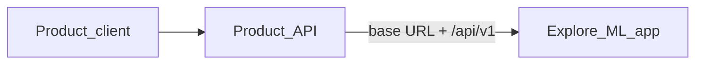
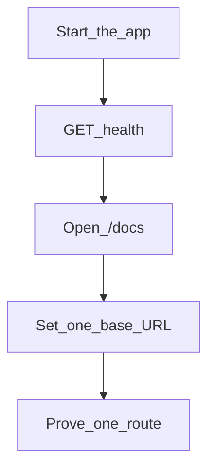

# User guide

Run the Explore ML app with the modules you need. Point your product API at
its one base URL. Prefer the smallest path that proves one feature end to end.

For design rules see the [Guideline](../Guideline.md). For terms see the
[Glossary](../Glossary.md).

## Goal

Six optional modules in one process. One base URL. Loopback only from your
product API. Product clients never dial the app.


```mermaid
flowchart LR
  Client[Product_client]
  API[Product_API]
  ML[Explore_ML_app]
  Client --> API
  API -->|"base URL + /api/v1"| ML
```

## Get started

1. Start the app (see [Operator setup](operator-setup.md)).
2. Confirm health on the base URL:

```bash
curl -s http://localhost:8000/health
```

   The response lists every module with its `status` (`ok` or
   `degraded`) and `latency_ms`.

3. Open `http://localhost:8000/docs` and copy one request from OpenAPI.
4. Point the product API's upstream at `http://localhost:8000` (see
   [Loopback integration](loopback-integration.md)).
5. Call the same route through the product API once.

Download checkpoints only when a local Speech / Image Playground / Video or rerank backend needs them
([Model download](model-download.md)). Skip downloads when you use a
lightweight or Hub-backed backend.

The local default is `http://localhost:8000` for every module.

The Angular operator console in `ui/` runs on `http://localhost:4200` and
proxies `/ml/*` to the app. Use it to try each module by hand, with D3 charts
of the results, before you wire your own API.


```mermaid
flowchart TB
  Start[Start_the_app]
  Health[GET_health]
  Docs[Open_/docs]
  Env[Set_one_base_URL]
  Prove[Prove_one_route]
  Start --> Health --> Docs --> Env --> Prove
```

## Useful endpoints

Relative to the base URL:

- Health — `GET /health` (every module)
- Contract — `GET /docs` and `GET /openapi.json` (all modules in one
  document)
- Recommendation — `POST /api/v1/feeds:rank`, `explores:rank`, `reels:rank`,
  `feeds:recall`
- Vision — `POST /api/v1/images:predict`, `images:moderate`, `videos:moderate`
- RAG documents — `POST /api/v1/documents`, `GET /api/v1/documents`,
  `GET /api/v1/documents/{id}`, `DELETE /api/v1/documents/{id}`
- RAG query — `POST /api/v1/documents:query`, `documents:streamQuery`,
  `documents:exportVectors`; `GET /api/v1/collections`
- RAG ingest — `POST /api/v1/posts:sync`, `comments:sync`, `resources:sync`,
  `webpages:scrape`, `webpages:crawl`
- Image Playground — `POST /api/v1/images:generate`, then poll
  `GET /api/v1/imageJobs/{id}`
- Speech — `POST /api/v1/voices:synthesize`, `audios:transcribe`; WebSocket
  `/ws/v1/audios:transcribe` for streaming ASR
- Video — `POST /api/v1/videos:generate`, then poll
  `GET /api/v1/videoJobs/{id}`

Prefer `/docs` over memorizing bodies. Keep custom-method names stable when
code moves.

## Next steps

### Run the app

**Follow [Operator setup](operator-setup.md).** One process, one port, one
health URL.

### Connect your API

**Follow [Loopback integration](loopback-integration.md).** One env var for
every feature.

### Fetch checkpoints

**Follow [Model download](model-download.md).** Only when local weights are the
chosen backend.

### Adapt a model

**Follow [Fine-tuning](fine-tuning.md).** Train, compare with the base model,
and promote with one env var.

## Related

[Operator setup](operator-setup.md)

[Loopback integration](loopback-integration.md)

[Model download](model-download.md)

[Fine-tuning](fine-tuning.md)

[Guideline](../Guideline.md)

[Glossary](../Glossary.md)
