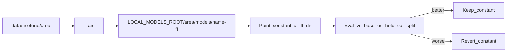
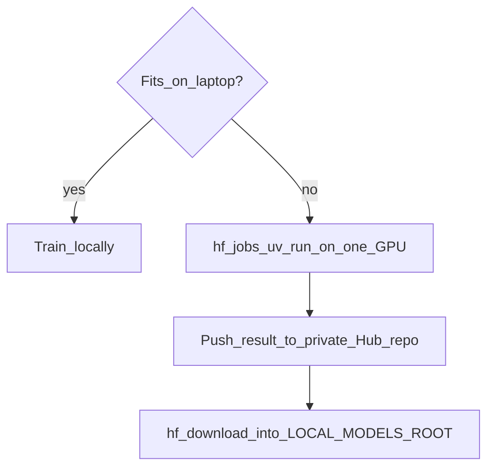

# Fine-tuning

← [User guide home](README.md)

Adapt a module's model to your own data. Train once, write the result under
`LOCAL_MODELS_ROOT`, point one config constant at it, and keep `/api/v1`
routes unchanged.

Fine-tune only after the base model works end to end. Most quality problems
are fixed faster with better data, thresholds, or prompts.

## Goal

One loop for every module. Train, evaluate against the base model, then
promote or roll back by changing a single constant in the module's
`config.py`.



## Choose where to train

Train small models on your Mac. Rent one GPU for large ones.

- **Local (MPS or CPU)** — recommendation ranker, vision head, embedding model.
- **Hugging Face Jobs, one GPU** — reranker, RAG LLM, Qwen-Image LoRA,
  Qwen3-ASR, Qwen3-TTS. Use `l40sx1` by default and `a100-large` for
  Qwen-Image.



## Get started

1. Install the Hub client and sign in once:

```bash
pip install -U huggingface_hub
hf auth login
```

2. Use the app's models root in your shell:

```bash
export LOCAL_MODELS_ROOT="$HOME/Codes/models"
```

3. Put a small train and eval split under `data/finetune/<area>/`. Commit only
   tiny fixtures; keep real data on disk or in a private Hub dataset.
4. Install training dependencies for the module you tune. Every command
   below runs from `python_ml/`, the same directory the app starts from:

```bash
cd python_ml
pip install -r <module>/requirements-train.txt
```

5. Train, evaluate, and set the constant shown in the section for your module.

Name every output `<base>-ft-<yyyymmdd>`. Never overwrite a base model.

## Recommendation

Warm-start the feed ranker from the current checkpoint and continue on recent
engagement.

```bash
cd python_ml
MODEL_DIR="$LOCAL_MODELS_ROOT/recommendation/models"
python -m recommendation.run_jobs --job feed_rank \
  --init-from "$MODEL_DIR/feed_ranker.pt" \
  --output "$MODEL_DIR/feed_ranker-ft-$(date +%Y%m%d).pt"
```

Compare against the current model on a held-out file:

```bash
python -m recommendation.training.eval_feed_ranker \
  --model "$MODEL_DIR/feed_ranker-ft-<yyyymmdd>.pt" \
  --baseline "$MODEL_DIR/feed_ranker.pt" \
  --holdout ../data/finetune/recommendation/eval.jsonl
```

Promote by pointing `FEED_RANKER_MODEL` in `recommendation/config.py` at
the new file.

## Vision

Replace the ResNet50 head with your labels. Arrange images as one folder per
label under `train/` and `eval/`. Git tracks only `.jsonl` files under
`data/finetune/`, so the vision image folders stay local.

```bash
cd python_ml
python -m vision.training.train_head \
  --data ../data/finetune/vision \
  --output "$LOCAL_MODELS_ROOT/vision/models/resnet50-ft-$(date +%Y%m%d)"
python -m vision.training.eval_head \
  --data ../data/finetune/vision/eval \
  --model "$LOCAL_MODELS_ROOT/vision/models/resnet50-ft-<yyyymmdd>"
```

Promote by setting `MODEL_PATH` to `<dir>/model.pt` and `LABELS_PATH` to
`<dir>/labels.json` in `vision/config.py`. Keep NudeNet as is; tune
`NSFW_THRESHOLD` instead of retraining it.

With a custom head loaded, `images:moderate` skips the ImageNet "prohibited"
class check, because those class ids no longer match your labels. Only the
NudeNet check runs until you add your own moderation rule.

## RAG retrieval

### Embeddings

Fine-tune the embedding model on query and passage pairs. Keep 768 dimensions
so the vector store schema stays the same.

```bash
cd python_ml
python -m rag.training.train_embedding \
  --train ../data/finetune/rag/pairs.jsonl \
  --output "$LOCAL_MODELS_ROOT/embed/models/nomic-embed-ft-$(date +%Y%m%d)"
rag/training/to_ollama.sh "$LOCAL_MODELS_ROOT/embed/models/nomic-embed-ft-<yyyymmdd>" nomic-embed-ft
```

Set `EMBEDDING_MODEL = "nomic-embed-ft"` in `rag/config.py`, then re-index every document. Vectors
from different models never mix.

### Reranker

Train a LoRA reranker on one GPU and pull the merged result. The script
starts from `Qwen/Qwen3-Reranker-0.6B` (`--base-model`), while the sidecar
serves `Qwen3-Reranker-8B` by default. Compare the tuned 0.6B model with the
8B default, not only with the 0.6B base:

```bash
hf jobs uv run --flavor l40sx1 --secrets HF_TOKEN \
  rag/training/train_reranker.py \
  --dataset <you>/rag-rerank --push-to <you>/qwen3-reranker-ft
hf download <you>/qwen3-reranker-ft \
  --local-dir "$LOCAL_MODELS_ROOT/rerank/models/qwen3-reranker-ft"
```

Point the rerank sidecar at that directory.

Measure both changes with the same query set:

```bash
python -m rag.training.eval_retrieval --queries ../data/finetune/rag/eval.jsonl
```

## RAG LLM

Train a QLoRA adapter on chat-format examples, merge it, and serve it through
Ollama. The script tunes `Qwen/Qwen3-8B` (`--base-model`), so `qwen3:8b` is
the fair baseline. RAG serves `qwen3-coder:30b` (`LLM_MODEL` in `rag/config.py`);
run a second comparison against it before you switch.

```bash
cd python_ml
hf jobs uv run --flavor l40sx1 --timeout 6h --secrets HF_TOKEN \
  rag/training/train_sft.py \
  --dataset <you>/rag-sft --push-to <you>/rag-llm-ft
hf download <you>/rag-llm-ft \
  --local-dir "$LOCAL_MODELS_ROOT/llm/models/rag-llm-ft"
rag/training/to_ollama.sh "$LOCAL_MODELS_ROOT/llm/models/rag-llm-ft" rag-llm-ft
python -m rag.training.eval_answers \
  --questions ../data/finetune/rag/qa.jsonl \
  --model rag-llm-ft --baseline qwen3:8b
```

Promote with `LLM_MODEL = "rag-llm-ft"`.

## Image Playground

Train a LoRA on 20 to 200 captioned images. Upload them as a private Hub
dataset first.

```bash
cd python_ml
hf jobs uv run --flavor a100-large --timeout 6h --secrets HF_TOKEN \
  image_playground/training/train_lora.py \
  --dataset <you>/my-style --instance-prompt "a photo in my-style" \
  --push-to <you>/qwen-image-my-style
hf download <you>/qwen-image-my-style \
  --local-dir "$LOCAL_MODELS_ROOT/image/loras/my-style"
```

Compare with fixed prompts and seeds before you keep it. The script writes
base and LoRA images side by side:

```bash
python -m image_playground.training.compare_prompts \
  --lora "$LOCAL_MODELS_ROOT/image/loras/my-style" \
  --prompts prompts.txt --out compare --seed 0 --steps 20
```

Promote by setting `IMAGE_LORA_PATH` to the directory (and optionally
`IMAGE_LORA_SCALE = 0.8`) in `image_playground/config.py`.

## Speech

### ASR

Upload `audio` and `text` pairs as a Hub dataset, then:

```bash
cd python_ml
hf jobs uv run --flavor l40sx1 --timeout 6h --secrets HF_TOKEN \
  speech/training/train_asr.py \
  --dataset <you>/asr-domain --push-to <you>/qwen3-asr-ft
hf download <you>/qwen3-asr-ft \
  --local-dir "$LOCAL_MODELS_ROOT/asr/models/qwen3-asr-ft"
python -m speech.training.eval_wer \
  --manifest ../data/finetune/speech/eval.jsonl \
  --model "$LOCAL_MODELS_ROOT/asr/models/qwen3-asr-ft" \
  --baseline "$LOCAL_MODELS_ROOT/asr/models/Qwen3-ASR-1.7B"
```

Promote by setting `ASR_MODEL` to the directory in `speech/config.py`.

### TTS

Record about one hour of clean speech from one speaker. Upload `audio`,
`text`, and `ref_audio` rows, then:

```bash
hf jobs uv run --flavor l40sx1 --timeout 6h --secrets HF_TOKEN \
  speech/training/train_tts.py \
  --dataset <you>/tts-voice --speaker my_voice --push-to <you>/qwen3-tts-ft
hf download <you>/qwen3-tts-ft \
  --local-dir "$LOCAL_MODELS_ROOT/tts/models/qwen3-tts-ft"
```

Promote by setting `TTS_MODEL` to the directory and `TTS_SPEAKER` to
`"my_voice"` in `speech/config.py`. Listen to a fixed
script, and transcribe it with ASR to catch regressions.

## Related

[User guide home](README.md)

[Model download](model-download.md)

[Guideline](../Guideline.md)
