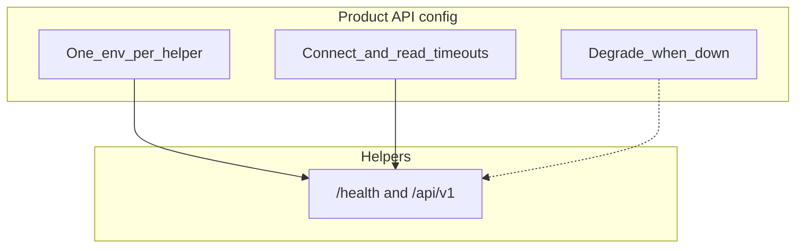
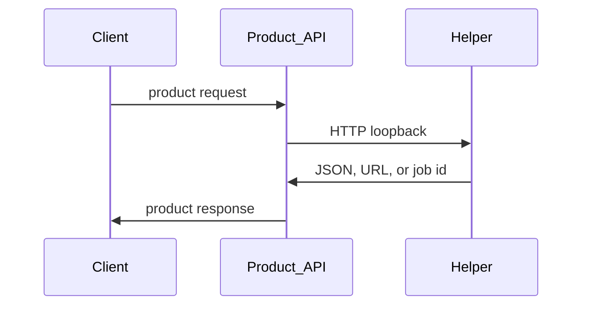
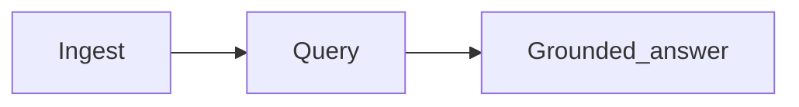
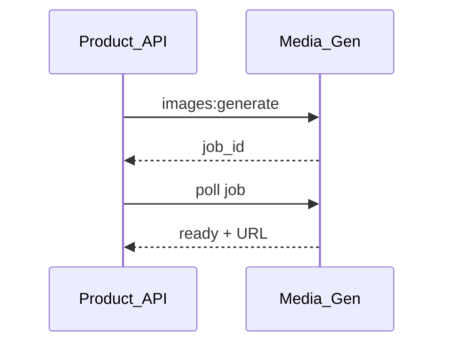

# Loopback integration

← [User guide home](README.md)

Connect your product API to Explore ML the easy way: one base URL per helper,
timeouts on the server, contracts from OpenAPI. Call helpers only from the
back channel. Never expose helper ports to browsers or mobile clients.

This page is a **target integration guide**. Field names and folder layouts may
change; keep the wiring shape and align code over time.

## Before you start

1. At least one helper is up ([Operator setup](operator-setup.md)).
2. Health returns OK:

```bash
curl -s "$HELPER/health"
```

3. You opened `$HELPER/docs` and know which `/api/v1` method you need.

## Wire base URLs

Set one upstream string per helper you use. Local defaults for a full stack:

```bash
export RECOMMENDATION_API_URL=http://localhost:8000
export VISION_SERVICE_URL=http://localhost:8001
export RAG_SERVICE_URL=http://localhost:8002
export MEDIA_GENERATION_API_URL=http://localhost:8003
```

For a single feature, set **only** that helper’s URL. Keep model roots and
secrets on the helper side—never in the client bundle.





## Prove one route (easiest path)

Copy a request from `$HELPER/docs`. Smoke it with curl against the helper,
then call the same path from your API client.

### Recommendation — rank a short list

```bash
curl -s -X POST "$RECOMMENDATION_API_URL/api/v1/feeds:rank" \
  -H 'Content-Type: application/json' \
  -d '{"user_id":"demo","candidate_ids":["1","2","3"]}'
```

Prefer separate recall and rank when you own candidate generation (see
[Guideline](../Guideline.md) two-stage ranking).

### Vision — moderate a file

```bash
curl -s -X POST "$VISION_SERVICE_URL/api/v1/images:moderate" \
  -F "file=@sample.jpg"
```

Keep `images:predict` for labels and `images:moderate` for policy decisions.

### RAG — ingest then ask

```bash
curl -s -X POST "$RAG_SERVICE_URL/api/v1/documents" \
  -F "file=@./notes.md"

curl -s -X POST "$RAG_SERVICE_URL/api/v1/documents:query" \
  -H 'Content-Type: application/json' \
  -d '{"query":"What should I do first?","top_k":5}'
```

Stream long answers with `documents:streamQuery` when the UI needs tokens.



### Media Gen — generate then poll

```bash
curl -s -X POST "$MEDIA_GENERATION_API_URL/api/v1/images:generate" \
  -H 'Content-Type: application/json' \
  -d '{"prompt":"a quiet desk lamp"}'
```

Treat heavy work as a job: store the `job_id`, poll until ready, then return the
asset URL to the client.

```bash
curl -s -X POST "$MEDIA_GENERATION_API_URL/api/v1/voices:synthesize" \
  -H 'Content-Type: application/json' \
  -d '{"text":"Hello from Explore ML"}'

curl -s -X POST "$MEDIA_GENERATION_API_URL/api/v1/audios:transcribe" \
  -F "file=@sample.wav"
```

Swap backends with env (`IMAGE_BACKEND`, `VOICE_BACKEND`, model ids)—keep the
same routes.



## Integration rules

1. Call helpers only from the product API (or another trusted server).
2. Own timeouts and fallbacks in the API. Degrade the feature when a helper is
   down.
3. Treat `/docs` + `/api/v1/...` as the contract.
4. Change a port only when you update both the helper and every upstream.
5. Prefer loopback or private network URLs—not public ingress.

## Checklist

1. Set one base URL per helper you use.
2. Confirm `GET /health`.
3. Smoke one `/api/v1` route with curl.
4. Call the same route from the product API.
5. Stop the helper and confirm the product fails gracefully.

## Smoke test

1. Start one helper ([Operator setup](operator-setup.md)).
2. `curl "$HELPER/health"`.
3. Run one curl example above.
4. Point the product env at `$HELPER`.
5. Repeat the action once through the product.

## Related

[Operator setup](operator-setup.md)

[Model download](model-download.md)

[User guide home](README.md)

[Guideline](../Guideline.md)
