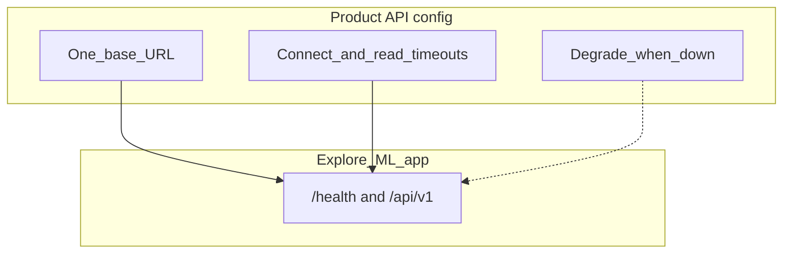
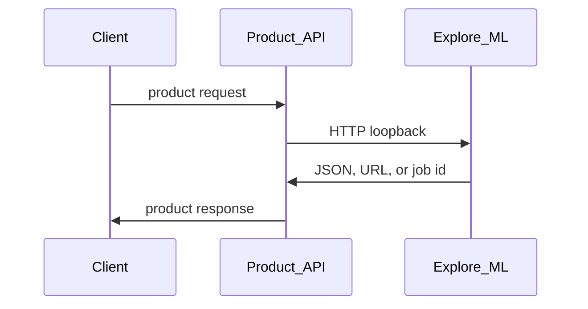
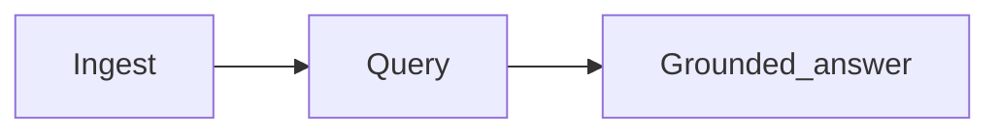
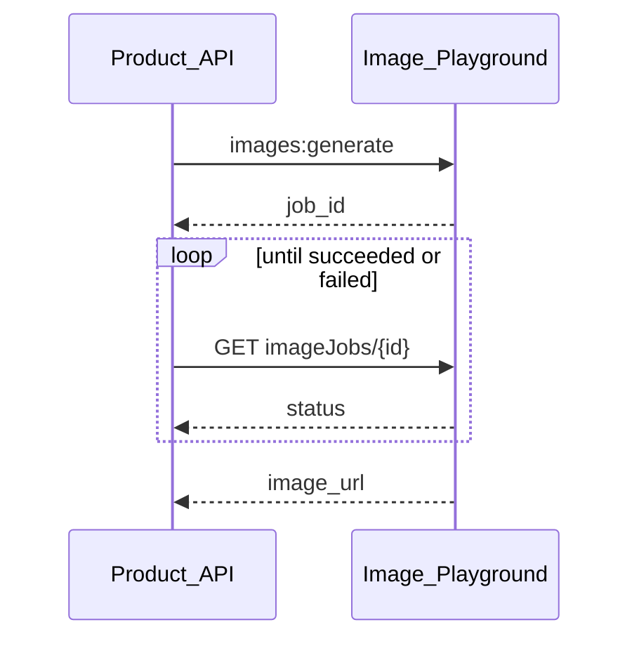

# Loopback integration

← [User guide home](README.md)

Connect your product API to Explore ML the easy way: one base URL, timeouts
on the server, contracts from OpenAPI. Call the app only from the back
channel. Never expose its port to browsers or mobile clients.

## Before you start

1. The app is up with the module you need ([Operator setup](operator-setup.md)).
2. The module reports `ok` (or `degraded` with a known reason):

```bash
curl -s "http://localhost:8000/health"
```

3. You opened `http://localhost:8000/docs` and know which `/api/v1` method you need.

## Wire the base URL

Point your product API's upstream at one URL, `http://localhost:8000`.
Every module answers under it, so a new feature needs no new upstream.
Keep model roots and secrets on the app side—never in the client bundle.


```mermaid
flowchart TB
  subgraph product [Product API config]
    Env[One_base_URL]
    Timeout[Connect_and_read_timeouts]
    Fallback[Degrade_when_down]
  end
  subgraph ml [Explore_ML_app]
    HTTP["/health and /api/v1"]
  end
  Env --> HTTP
  Timeout --> HTTP
  Fallback -.-> HTTP
```


```mermaid
sequenceDiagram
  participant Client
  participant API as Product_API
  participant ML as Explore_ML
  Client->>API: product request
  API->>ML: HTTP loopback
  ML->>API: JSON, URL, or job id
  API->>Client: product response
```

## Prove one route (easiest path)

Copy a request from `http://localhost:8000/docs`. Smoke it with curl against the
app, then call the same path from your API client.

### Recommendation — rank a short list

```bash
curl -s -X POST "http://localhost:8000/api/v1/feeds:rank" \
  -H 'Content-Type: application/json' \
  -d '{"user_id":"demo","candidate_ids":["1","2","3"]}'
# {"items":[{"id":"2","score":0.91}, ...]}
```

`limit` defaults to 50. `feeds:recall` takes `{user_id, limit}` (default 100)
and returns the same `items` shape.

Prefer separate recall and rank when you own candidate generation (see
[Guideline](../Guideline.md) two-stage ranking).

### Vision — moderate a file

```bash
curl -s -X POST "http://localhost:8000/api/v1/images:moderate" \
  -F "file=@sample.jpg"
```

Keep `images:predict` for labels and `images:moderate` for policy decisions.
The moderation response carries `safe`, the flagged `categories`, every
category's `scores` and the `thresholds` used; `videos:moderate` adds one
`frames` entry per sampled frame (`offset_seconds`, `scores`, `safe`).

### RAG — ingest then ask

```bash
curl -s -X POST "http://localhost:8000/api/v1/documents" \
  -F "file=@./notes.md"

curl -s -X POST "http://localhost:8000/api/v1/documents:query" \
  -H 'Content-Type: application/json' \
  -d '{"query":"What should I do first?","top_k":5}'
```

Stream long answers with `documents:streamQuery` when the UI needs tokens.
It sends Server-Sent Events (`data: ...` frames) and ends with
`data: [DONE]`.


```mermaid
flowchart LR
  Ingest[Ingest]
  Ask[Query]
  Answer[Grounded_answer]
  Ingest --> Ask --> Answer
```

### Speech — results come back directly

Speech does not use jobs. Synthesis returns the audio URL and transcription
returns the text in the same response.

```bash
curl -s -X POST "http://localhost:8000/api/v1/voices:synthesize" \
  -H 'Content-Type: application/json' \
  -d '{"text":"Hello from Explore ML"}'
# {"audio_url":"http://localhost:8000/output/voice/<id>.wav"}
# (.mp3 when VOICE_BACKEND is "edge")

curl -s -X POST "http://localhost:8000/api/v1/audios:transcribe" \
  -F "file=@sample.wav"
# {"text":"...","language":"en"}
```

For live captions, open the WebSocket `/ws/v1/audios:transcribe` and stream
PCM audio; it sends `partial` and `final` events.

### Image Playground / Video — generate then poll

```bash
curl -s -X POST "http://localhost:8000/api/v1/images:generate" \
  -H 'Content-Type: application/json' \
  -d '{"prompt":"a quiet desk lamp"}'
# {"job_id":"<id>"}

curl -s "http://localhost:8000/api/v1/imageJobs/<id>"
# {"name":"imageJobs/<id>","status":"succeeded",
#  "image_url":"http://localhost:8000/output/image/<id>.png"}

curl -s -X POST "http://localhost:8000/api/v1/videos:generate" \
  -H 'Content-Type: application/json' \
  -d '{"prompt":"a calm pan across a desk"}'

curl -s "http://localhost:8000/api/v1/videoJobs/<id>"
```

Treat heavy work as a job: store the `job_id`, poll
`GET /api/v1/{imageJobs,videoJobs}/{id}` until `status` is `succeeded`, then
return `image_url` or `video_url` to the client. `status` is `pending`,
`succeeded` or `failed`; a failed job carries `error`. Unknown ids return 404.

Swap backends in the module's `config.py` (`IMAGE_BACKEND`, `VOICE_BACKEND`,
model ids)—keep the same routes.


```mermaid
sequenceDiagram
  participant API as Product_API
  participant IP as Image_Playground
  API->>IP: images:generate
  IP-->>API: job_id
  loop until succeeded or failed
    API->>IP: GET imageJobs/{id}
    IP-->>API: status
  end
  IP-->>API: image_url
```

## Integration rules

1. Call the app only from the product API (or another trusted server).
2. Own timeouts and fallbacks in the API. Degrade a feature when its module
   reports `degraded`, or the app is down.
3. Treat `/docs` + `/api/v1/...` as the contract.
4. Change the port only together with your upstream URL and `BASE_URL`
   in `python_ml/config.py`.
5. Prefer loopback or private network URLs—not public ingress.

## Checklist

1. Point the upstream at `http://localhost:8000`.
2. Confirm the module in `GET /health`.
3. Smoke one `/api/v1` route with curl.
4. Call the same route from the product API.
5. Stop the app and confirm the product fails gracefully.

## Smoke test

1. Start the app ([Operator setup](operator-setup.md)).
2. `curl http://localhost:8000/health`.
3. Run one curl example above.
4. Point the product upstream at `http://localhost:8000`.
5. Repeat the action once through the product.

## Related

[Operator setup](operator-setup.md)

[Model download](model-download.md)

[User guide home](README.md)

[Guideline](../Guideline.md)
