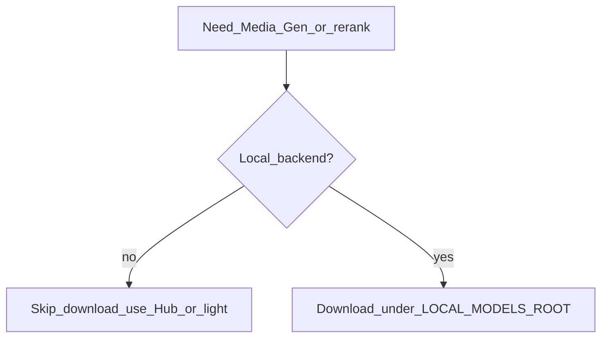
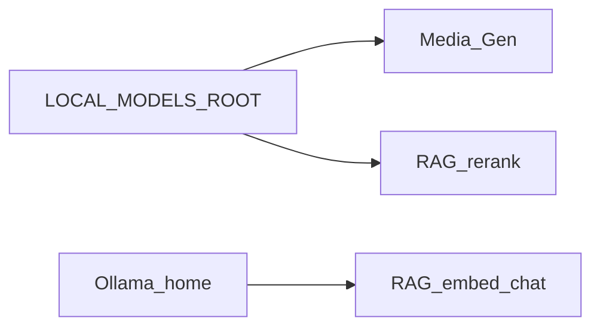
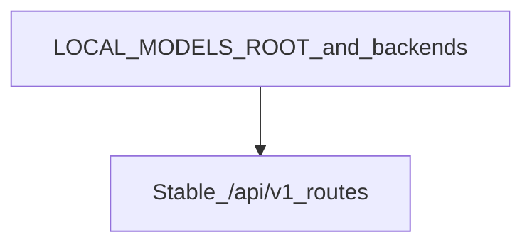

# Model download

← [User guide home](README.md)

Fetch local checkpoints only when you chose a local generative or rerank
backend. Point helpers at one root (`LOCAL_MODELS_ROOT`). Keep large weights out
of git.

This layout is a **target convention** for the easiest offline setup. Align
loaders to it over time. Prefer a Hub id or lightweight backend when you want
zero local disk.

For model choice see the [Guideline](../Guideline.md).

## When to download



Skip this guide when Vision / Recommendation online paths do not need those
weights, or when `IMAGE_BACKEND` / `VOICE_BACKEND` already avoid local Qwen.

## Target layout

One root. One folder per modality:

```text
$LOCAL_MODELS_ROOT/
├── asr/models/<asr-model>/
├── tts/models/<tts-model>/
├── image/models/<image-model>/
└── rerank/models/<rerank-model>/
```

Example ids that fit the target tree:

- ASR — `Qwen/Qwen3-ASR-1.7B`
- TTS — `Qwen/Qwen3-TTS-12Hz-1.7B-CustomVoice`
- Image — `Qwen/Qwen-Image`
- Rerank — `Qwen/Qwen3-Reranker-8B`

Keep Ollama LLM packages in the Ollama home via `ollama pull`—not under
`LOCAL_MODELS_ROOT`.



## Prepare tools

Install one Hub client:

```bash
pip install -U "huggingface_hub[cli]"
# or
pip install -U modelscope
```

Optional mirror:

```bash
export HF_ENDPOINT=https://hf-mirror.com
```

Set the root once:

```bash
export LOCAL_MODELS_ROOT="${LOCAL_MODELS_ROOT:-$HOME/Codes/models}"
mkdir -p "$LOCAL_MODELS_ROOT"/{asr,tts,image,rerank}/models
```

## Download what you need

Download only the modalities you will run locally.

### ASR

```bash
huggingface-cli download Qwen/Qwen3-ASR-1.7B \
  --local-dir "$LOCAL_MODELS_ROOT/asr/models/Qwen3-ASR-1.7B"
```

### TTS

```bash
huggingface-cli download Qwen/Qwen3-TTS-12Hz-1.7B-CustomVoice \
  --local-dir "$LOCAL_MODELS_ROOT/tts/models/Qwen3-TTS-12Hz-1.7B-CustomVoice"
```

### Image

Expect a large first download.

```bash
huggingface-cli download Qwen/Qwen-Image \
  --local-dir "$LOCAL_MODELS_ROOT/image/models/Qwen-Image"
```

### Rerank

```bash
huggingface-cli download Qwen/Qwen3-Reranker-8B \
  --local-dir "$LOCAL_MODELS_ROOT/rerank/models/Qwen3-Reranker-8B"
```

ModelScope works the same way with `modelscope download --model … --local_dir …`
when Hugging Face is unreachable.

## Wire helpers (easiest config)

Export the same root the helpers read:

```bash
export LOCAL_MODELS_ROOT="${LOCAL_MODELS_ROOT:-$HOME/Codes/models}"
```

Prefer defaults that resolve under that root. Override with a path or Hub id
when needed. Swap away from local weights with backend flags—keep `/api/v1`
routes unchanged.

For optional rerank, set one sidecar URL and one model path; if the sidecar is
down, keep vector order (see [Guideline](../Guideline.md)).



## Ollama (RAG embed / chat)

```bash
ollama pull nomic-embed-text
ollama pull qwen3-coder:30b
```

## Verify

```bash
ls "$LOCAL_MODELS_ROOT/asr/models/Qwen3-ASR-1.7B"
curl -s "$HELPER/health"
```

Fail clearly when a required path is empty—do not hang on an unexpected Hub
pull inside a hot request.

## Related

[User guide home](README.md)

[Operator setup](operator-setup.md)

[Loopback integration](loopback-integration.md)

[Guideline](../Guideline.md)
