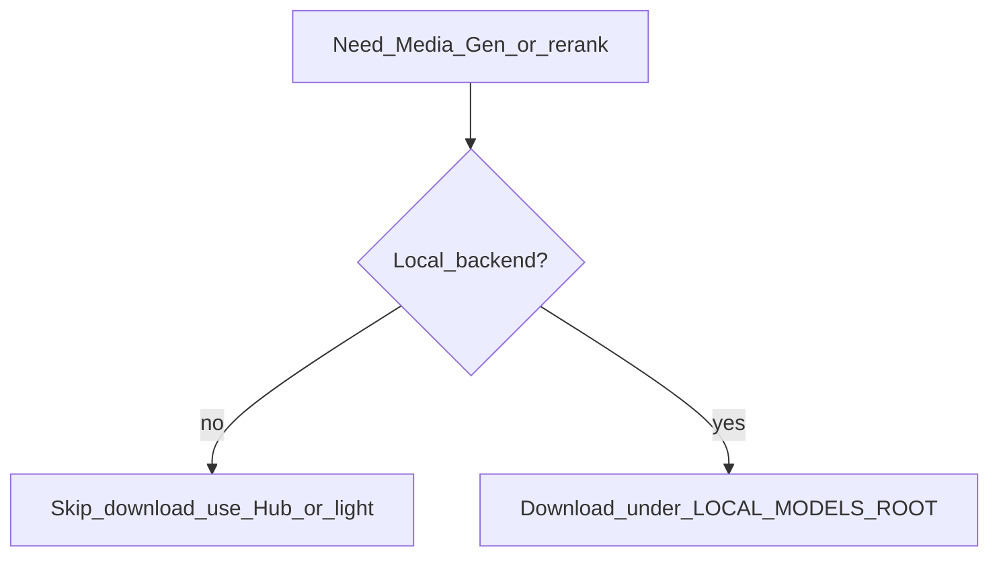
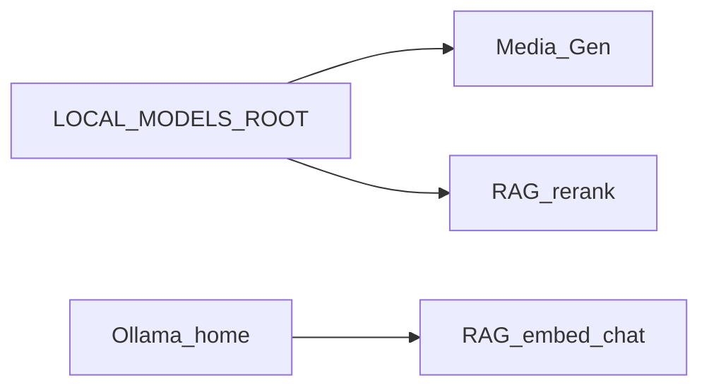
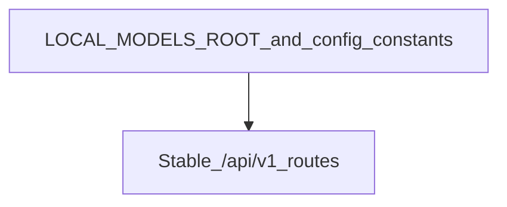

# Model download

← [User guide home](README.md)

Fetch local checkpoints only when you chose a local generative or rerank
backend. The app reads one root, `~/Codes/models` (`LOCAL_MODELS_ROOT`
in `python_ml/config.py`). Keep large weights out of git.

Speech, Image Playground, RAG rerank and recommendation read paths under this
root. Video loads `COGVIDEOX_MODEL` as a Hugging Face id and ignores the root.
Prefer a Hub id or lightweight backend when you want zero local disk.

For model choice see the [Guideline](../Guideline.md).

## When to download


```mermaid
flowchart TB
  Need[Need_Media_Gen_or_rerank]
  Local{Local_backend?}
  Skip[Skip_download_use_Hub_or_light]
  Fetch[Download_under_LOCAL_MODELS_ROOT]
  Need --> Local
  Local -->|no| Skip
  Local -->|yes| Fetch
```

Skip this guide when Vision / Recommendation online paths do not need those
weights, or when `IMAGE_BACKEND` / `VOICE_BACKEND` already avoid local Qwen.

## Layout

One root. One folder per area, shared with the
[Fine-tuning](fine-tuning.md) guide:

```text
$LOCAL_MODELS_ROOT/
├── asr/models/<asr-model>/
├── tts/models/<tts-model>/
├── image/models/<image-model>/
├── image/loras/<lora>/              # IMAGE_LORA_PATH
├── rerank/models/<rerank-model>/
├── embed/models/<embed-ft>/         # fine-tuned, then imported to Ollama
├── llm/models/<llm-ft>/             # fine-tuned, then imported to Ollama
├── vision/models/<resnet50-ft>/
└── recommendation/models/           # RECOMMENDATION_MODEL_DIR, feed_ranker.pt
```

Recommendation reads `FEED_RANKER_MODEL`, `feed_ranker.pt` under
`RECOMMENDATION_MODEL_DIR` (`$LOCAL_MODELS_ROOT/recommendation/models`). Those files come from its own training
jobs, not from a Hub download.

Default ids the modules expect:

- ASR — `Qwen/Qwen3-ASR-1.7B`
- TTS — `Qwen/Qwen3-TTS-12Hz-1.7B-CustomVoice`
- Image — `Qwen/Qwen-Image`
- Rerank — `Qwen/Qwen3-Reranker-8B`

Keep Ollama LLM packages in the Ollama home via `ollama pull`—not under
`LOCAL_MODELS_ROOT`.


```mermaid
flowchart LR
  Root[LOCAL_MODELS_ROOT]
  Media[Media_Gen]
  Rerank[RAG_rerank]
  Ollama[Ollama_home]
  RAG[RAG_embed_chat]
  Root --> Media
  Root --> Rerank
  Ollama --> RAG
```

## Prepare tools

Install one Hub client:

```bash
pip install -U huggingface_hub   # provides the `hf` CLI
# or
pip install -U modelscope
```

The app sets `HF_ENDPOINT=https://hf-mirror.com` when it is unset. Set the same mirror in your shell before `hf download`, or
set `HF_ENDPOINT=https://huggingface.co` to use the main Hub:

```bash
export HF_ENDPOINT=https://hf-mirror.com
```

Use the same root in your shell:

```bash
export LOCAL_MODELS_ROOT="$HOME/Codes/models"
mkdir -p "$LOCAL_MODELS_ROOT"/{asr,tts,image,rerank}/models
```

## Download what you need

Download only the modalities you will run locally.

### ASR

```bash
hf download Qwen/Qwen3-ASR-1.7B \
  --local-dir "$LOCAL_MODELS_ROOT/asr/models/Qwen3-ASR-1.7B"
```

### TTS

```bash
hf download Qwen/Qwen3-TTS-12Hz-1.7B-CustomVoice \
  --local-dir "$LOCAL_MODELS_ROOT/tts/models/Qwen3-TTS-12Hz-1.7B-CustomVoice"
```

### Image

Expect a large first download.

```bash
hf download Qwen/Qwen-Image \
  --local-dir "$LOCAL_MODELS_ROOT/image/models/Qwen-Image"
```

### Rerank

```bash
hf download Qwen/Qwen3-Reranker-8B \
  --local-dir "$LOCAL_MODELS_ROOT/rerank/models/Qwen3-Reranker-8B"
```

ModelScope works the same way with `modelscope download --model … --local_dir …`
when Hugging Face is unreachable.

## Wire modules (easiest config)

The defaults resolve under the root, so downloaded weights need no change.
To use another path or Hub id, or a backend without local weights, edit
the constant in the module's `config.py`—`/api/v1` routes stay unchanged:
`ASR_MODEL` and `TTS_MODEL` (`speech/config.py`), `IMAGE_MODEL` and
`IMAGE_LORA_PATH` (`image_playground/config.py`), `COGVIDEOX_MODEL`
(`video/config.py`, Hub id). To move the root itself, change
`LOCAL_MODELS_ROOT` in `python_ml/config.py`.

RAG rerank is on. It calls a sidecar that serves
`$LOCAL_MODELS_ROOT/rerank/models/Qwen3-Reranker-8B`; `rag/config.py`
holds:

| Constant | Value |
| --- | --- |
| `RERANK_ENABLED` | `True` (`False` skips rerank) |
| `RERANK_URL` | `http://127.0.0.1:8091` |
| `RERANK_TIMEOUT` | `30.0` seconds |

If the sidecar is down, RAG keeps vector order (see
[Guideline](../Guideline.md)).


```mermaid
flowchart TB
  Env[LOCAL_MODELS_ROOT_and_config_constants]
  Routes[Stable_/api/v1_routes]
  Env --> Routes
```

## Ollama (RAG embed / chat)

```bash
ollama pull nomic-embed-text
ollama pull qwen3-coder:30b
```

## Verify

```bash
ls "$LOCAL_MODELS_ROOT/asr/models/Qwen3-ASR-1.7B"
curl -s http://localhost:8000/health   # speech lists its voice and asr backends
```

Fail clearly when a required path is empty—do not hang on an unexpected Hub
pull inside a hot request.

## Related

[User guide home](README.md)

[Operator setup](operator-setup.md)

[Loopback integration](loopback-integration.md)

[Guideline](../Guideline.md)
