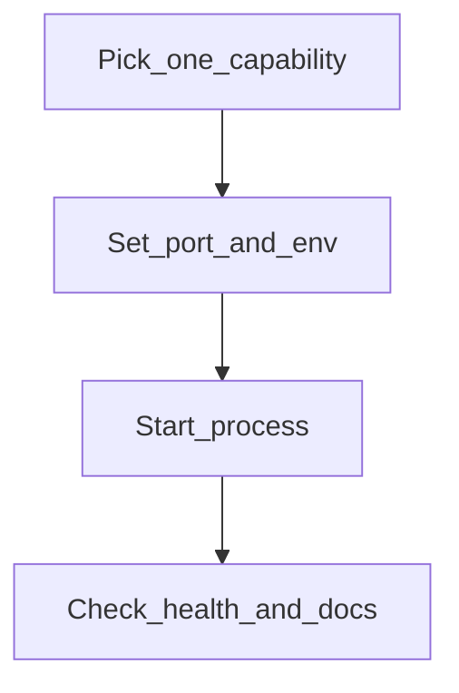
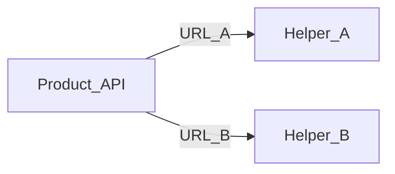

# Operator setup

← [User guide home](README.md)

Stand up Explore ML with the smallest durable config: one helper process, one
port, one health URL. Start only what you need. Treat this as the **target
runbook**—independent of today’s folders or entrypoints; align code to it over
time.

## Before you start

Install a current Python toolchain and a way to run the helper process (local
venv, container, or process manager). Optional:

- Vector DB — when RAG stores embeddings locally
- Local LLM runtime — when RAG embeds or chats offline
- Redis — when recommendation batch jobs need a broker
- GPU or Apple MPS — when Speech / Image Playground / Video should run faster

Download local weights only if you chose a local Speech / Image Playground / Video or rerank backend
([Model download](model-download.md)).

## Steps

1. Choose **one** capability to prove first (recommendation, vision, RAG, or
   media).
2. Configure a single listen port and base URL. Prefer contiguous defaults:

- Recommendation — `8000`
- Vision — `8001`
- RAG — `8002`
- Image Playground — `8003`
- Speech — `8004`
- Video — `8005`

3. Provide secrets and datastore URLs through env (never commit them). Copy
   from an example file when the helper ships one.
4. Start the helper so it serves HTTP on that port.
5. Verify:

```bash
export HELPER=http://localhost:8000   # change port to match
curl -s "$HELPER/health"
open "$HELPER/docs"                   # or visit in a browser
```

6. Stop here until one route works. Add the next helper only when the product
   feature needs it.



## Run more than one helper

Give each helper its own process and port. Keep base URLs unique. Point the
product API at each URL after health is OK—see
[Loopback integration](loopback-integration.md).



## Optional dependencies

### RAG

Start an embedding/chat runtime and a vector store before the first ingest.
Keep their URLs in the helper env. Prefer one local stack (for example Ollama +
Qdrant) for the easiest offline path.

### Recommendation batch

Start a job worker only when you need scheduled recall or training. Online rank
should work without the worker when scores or candidates are already available.

### Speech / Image Playground / Video

Prefer auto device selection. Force CPU with one env flag when GPUs are
unavailable. Skip video on platforms that cannot run it unless you explicitly
opt in.

## Environment checklist

Set these once and keep them aligned:

- **Base URL** — public address your API uses (`http://localhost:<port>`)
- **Listen port** — same host the base URL names
- **Secrets** — DB, Redis, API keys via env or a secret store
- **`LOCAL_MODELS_ROOT`** — only when local generative / rerank weights are on
- **Timeouts** — owned by the product API, not the browser

## If something fails

- Port in use — change the helper port and every upstream that points at it.
- Health fails — confirm the process listens on the URL you curl.
- OpenAPI missing routes — restart after config changes; use `/docs` as truth.
- Missing weights — download them, or switch to a Hub / lightweight backend.
- Rerank quiet — disable rerank with one flag, or start the optional sidecar.
- Slow first call — expect cold start; fail clearly if paths are empty.

## Related

[User guide home](README.md)

[Loopback integration](loopback-integration.md)

[Model download](model-download.md)

[Guideline](../Guideline.md)
