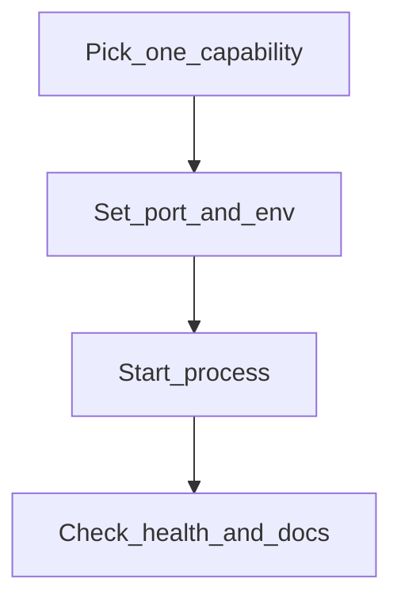
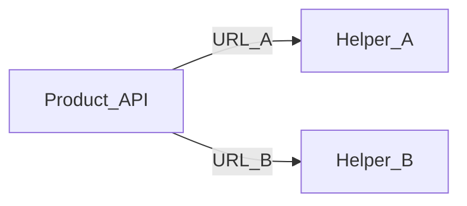

# Operator setup

← [User guide home](README.md)

Stand up Explore ML with the smallest durable config: one helper process, one
port, one health URL. Start only what you need. Treat this as the **target
runbook**—independent of today’s folders or entrypoints; align code to it over
time.

## Before you start

Install a current Python toolchain and a way to run the helper process (local
venv, container, or process manager). Optional:

- Vector DB — RAG uses embedded Qdrant under `python_ml/rag/data/qdrant` by
  default; set `QDRANT_URL` for a server
- Local LLM runtime — Ollama for RAG embeddings and chat
- PostgreSQL, Redis and Cassandra — when recommendation reads real
  engagement and follow data or runs batch jobs
- GPU or Apple MPS — when Speech / Image Playground / Video should run faster

Download local weights only if you chose a local Speech / Image Playground / Video or rerank backend
([Model download](model-download.md)).

## Steps

1. Choose **one** capability to prove first (recommendation, vision, RAG, or
   media).
2. Configure a single listen port and base URL. Defaults and the env vars
   that override them (the first one set wins):

| Helper | Port | Port env | Liveness check |
| --- | --- | --- | --- |
| Recommendation | `8000` | `PORT`, then `RECOMMENDATION_PORT` | `GET /health` |
| Vision | `8001` | `VISION_PORT` | `GET /health` |
| RAG | `8002` | `PORT` | `GET /health/ready` |
| Image Playground | `8003` | `IMAGE_PLAYGROUND_PORT`, then `PORT` | `GET /openapi.json` |
| Speech | `8004` | `SPEECH_PORT`, then `PORT` | `GET /openapi.json` |
| Video | `8005` | `VIDEO_PORT`, then `PORT` | `GET /openapi.json` |

   When you start a helper with `uvicorn --port`, keep the port env in sync:
   helpers build the asset URLs they return from it.

3. Provide secrets and datastore URLs through env (never commit them). Copy
   from `.env.example` when the helper ships one. Only RAG and
   recommendation load `.env` themselves; export the variables in your shell
   for the others.
4. Start the helper so it serves HTTP on that port.
5. Verify:

```bash
export HELPER=http://localhost:8000   # change port to match
curl -s "$HELPER/health"              # or /openapi.json for image, speech, video
open "$HELPER/docs"                   # or visit in a browser
```

6. Stop here until one route works. Add the next helper only when the product
   feature needs it.


```mermaid
flowchart TB
  Pick[Pick_one_capability]
  Port[Set_port_and_env]
  Run[Start_process]
  Health[Check_health_and_docs]
  Pick --> Port --> Run --> Health
```

## Run more than one helper

Give each helper its own process and port. Keep base URLs unique. Point the
product API at each URL after the liveness check passes—see
[Loopback integration](loopback-integration.md).


```mermaid
flowchart LR
  API[Product_API]
  H1[Helper_A]
  H2[Helper_B]
  API -->|"URL_A"| H1
  API -->|"URL_B"| H2
```

## Optional dependencies

### RAG

Start Ollama (`OLLAMA_BASE_URL`, default `http://localhost:11434`) before
the first ingest. Qdrant runs embedded by default, so no server is needed.
Rerank is on by default and calls a sidecar at `RERANK_URL`
(`http://127.0.0.1:8091`); set `RERANK_ENABLED=false` when the sidecar is
not running.

### Recommendation

Point recommendation at the same PostgreSQL (`DATABASE_URL`), Redis
(`REDIS_URL`) and Cassandra (`CASSANDRA_CONTACT_POINTS`) as the product
backend; features, follows and recall vectors come from them. Start a
Celery worker only when you need scheduled recall or training; the broker is
`CELERY_BROKER_URL`, falling back to `REDIS_URL`.

### Speech / Image Playground / Video

Device selection is automatic (CUDA, then Apple MPS, then CPU). Force CPU
with `SPEECH_DEVICE=cpu`, `IMAGE_PLAYGROUND_DEVICE=cpu` or `VIDEO_DEVICE=cpu`.
On macOS without CUDA, video jobs fail by design; set `VIDEO_FORCE_LOCAL=1` to
try local generation anyway.

## Environment checklist

Set these once and keep them aligned:

- **Base URL** — public address your API uses (`http://localhost:<port>`)
- **Listen port** — same host the base URL names
- **Secrets** — DB, Redis, API keys via env or a secret store
- **`LOCAL_MODELS_ROOT`** — only when local generative / rerank weights are on
- **Timeouts** — owned by the product API, not the browser

## If something fails

- Port in use — change the helper port and every upstream that points at it.
- Health fails — confirm the process listens on the URL you curl. Image
  Playground, Speech and Video return 404 for `/health`; use
  `/openapi.json`.
- OpenAPI missing routes — restart after config changes; use `/docs` as truth.
- Missing weights — download them, or switch to a Hub / lightweight backend.
- Rerank quiet — set `RERANK_ENABLED=false`, or start the sidecar at
  `RERANK_URL`.
- Slow first call — expect cold start; fail clearly if paths are empty.

## Related

[User guide home](README.md)

[Loopback integration](loopback-integration.md)

[Model download](model-download.md)

[Guideline](../Guideline.md)
