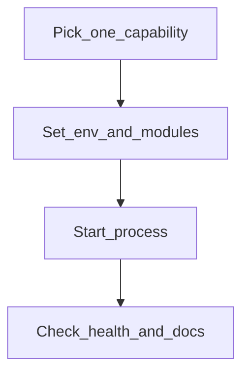

# Operator setup

← [User guide home](README.md)

Stand up Explore ML with the smallest durable config: one process, one port,
one health URL. Load only the modules you need.

## Before you start

Install Python 3.11+ and [uv](https://docs.astral.sh/uv/) (or pip), plus a
way to run the process (local venv, container, or process manager).
Optional:

- Vector DB — RAG uses embedded Qdrant under `python_ml/rag/data/qdrant` by
  default; set `QDRANT_URL` for a server
- Local LLM runtime — Ollama for RAG embeddings and chat
- PostgreSQL, Redis and Cassandra — when recommendation reads real
  engagement and follow data or runs batch jobs
- GPU or Apple MPS — when Speech / Image Playground / Video should run faster

Download local weights only if you chose a local Speech / Image Playground /
Video or rerank backend ([Model download](model-download.md)).

## Steps

1. Choose **one** capability to prove first (recommendation, vision, RAG, or
   media).
2. Install and configure from `python_ml/`:

```bash
cd python_ml
uv venv && source .venv/bin/activate
uv pip install -r requirements.txt --override overrides.txt
cp .env.example .env
```

   `.env` is loaded at startup and holds every module's settings, grouped by
   module. Never commit it.

3. Pick the listen port and modules:

| Variable | Default | Purpose |
| --- | --- | --- |
| `PORT` / `HOST` | `8000` / `0.0.0.0` | Listen address for every module |
| `BASE_URL` | `http://localhost:$PORT` | Base of the media URLs image, speech and video return |
| `EXPLORE_MODULES` | all six | Comma-separated subset, e.g. `rag,vision` |

   If clients reach the app under another address than
   `http://localhost:$PORT`, set `BASE_URL` to it, or returned media URLs
   will point at the wrong host.

4. Start the app:

```bash
uvicorn main:app --port 8000
# or: EXPLORE_MODULES=rag uvicorn main:app --port 8000
```

5. Verify:

```bash
export EXPLORE_ML_URL=http://localhost:8000
curl -s "$EXPLORE_ML_URL/health"   # status per module
open "$EXPLORE_ML_URL/docs"        # or visit in a browser
```

6. Stop here until one route works. Add the next module only when the
   product feature needs it.


```mermaid
flowchart TB
  Pick[Pick_one_capability]
  Env[Set_env_and_modules]
  Run[Start_process]
  Health[Check_health_and_docs]
  Pick --> Env --> Run --> Health
```

## Health

`GET /health` always answers 200 while the process is up:

```json
{
  "status": "degraded",
  "modules": {
    "vision": { "status": "ok", "model": "resnet50", "latency_ms": 0.02 },
    "rag": { "status": "degraded", "qdrant": true, "embeddings": false, "latency_ms": 1.2 }
  }
}
```

Use `/health/live` for a liveness probe and `/health/ready` for readiness;
the latter returns 503 with a reason per module until every loaded module is
ready. A module missing from `modules` was not loaded (`EXPLORE_MODULES`).

## Container

```bash
docker build -t explore-ml python_ml
docker run -p 8000:8000 --env-file python_ml/.env explore-ml
```

## Optional dependencies

### RAG

Start Ollama (`OLLAMA_BASE_URL`, default `http://localhost:11434`) before
the first ingest. Qdrant runs embedded by default, so no server is needed.
Rerank is on by default and calls a sidecar at `RERANK_URL`
(`http://127.0.0.1:8091`); set `RERANK_ENABLED=false` when the sidecar is
not running. Post and comment sync reads from `CONTENT_API_URL`.

### Recommendation

Point recommendation at the same PostgreSQL (`DATABASE_URL`), Redis
(`REDIS_URL`) and Cassandra (`CASSANDRA_CONTACT_POINTS`) as the product
backend; features, follows and recall vectors come from them. Start a
Celery worker only when you need scheduled recall or training
(`celery -A recommendation.celery_app worker -l info`); the broker is
`CELERY_BROKER_URL`, falling back to `REDIS_URL`.

### Speech / Image Playground / Video

Device selection is automatic (CUDA, then Apple MPS, then CPU). Force CPU
with `SPEECH_DEVICE=cpu`, `IMAGE_PLAYGROUND_DEVICE=cpu` or `VIDEO_DEVICE=cpu`.
On macOS without CUDA, video jobs fail by design; set `VIDEO_FORCE_LOCAL=1` to
try local generation anyway.

## Environment checklist

Set these once and keep them aligned:

- **Base URL** — the address your API uses (`http://localhost:8000`)
- **`BASE_URL`** — same address, when it is not `localhost:$PORT`
- **Secrets** — DB, Redis, API keys via `python_ml/.env` or a secret store
- **`LOCAL_MODELS_ROOT`** — only when local generative / rerank weights are on
- **Timeouts** — owned by the product API, not the browser

## If something fails

- Port in use — change `PORT` and the one upstream that points at it.
- A module shows `degraded` or `error` — read its fields in `/health`; for
  RAG, `embeddings: false` means Ollama or the embedding model is missing.
- A module is absent from `/health` — add it to `EXPLORE_MODULES`.
- OpenAPI missing routes — restart after config changes; use `/docs` as truth.
- Missing weights — download them, or switch to a Hub / lightweight backend.
- Rerank quiet — set `RERANK_ENABLED=false`, or start the sidecar at
  `RERANK_URL`.
- Slow first call — expect cold start; fail clearly if paths are empty.

## Related

[User guide home](README.md)

[Loopback integration](loopback-integration.md)

[Model download](model-download.md)

[Guideline](../Guideline.md)
