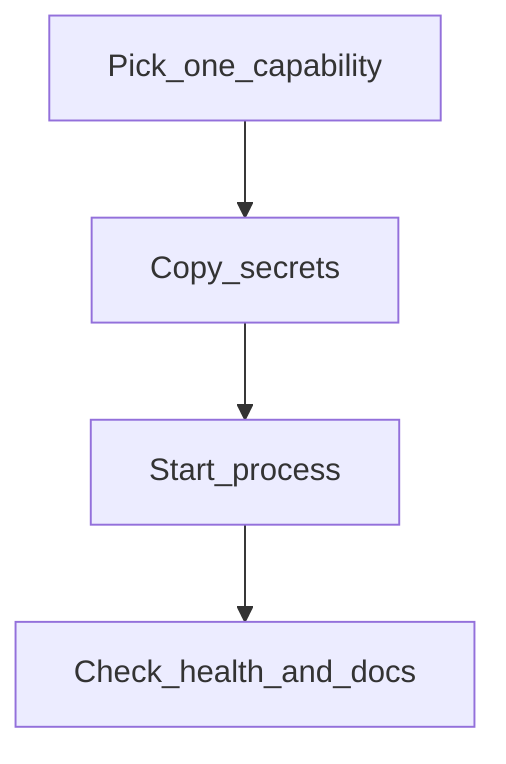

# Operator setup

← [User guide home](README.md)

Stand up Explore ML with the smallest durable config: one process, one port,
one health URL.

## Before you start

Install Python 3.11+ and [uv](https://docs.astral.sh/uv/) (or pip), plus a
way to run the process (local venv, container, or process manager).
Optional:

- Vector DB — RAG uses embedded Qdrant under `python_ml/rag/data/qdrant`;
  set `QDRANT_URL` in `rag/config.py` for a server
- Local LLM runtime — Ollama for RAG embeddings and chat
- PostgreSQL, Redis and Cassandra — when recommendation reads real
  engagement and follow data or runs batch jobs
- GPU or Apple MPS — when Speech / Image Playground / Video should run faster

Download local weights only if you chose a local Speech / Image Playground /
Video or rerank backend ([Model download](model-download.md)).

## Steps

1. Choose **one** capability to prove first (recommendation, vision, RAG, or
   media).
2. Install from `python_ml/` and copy the secrets file:

```bash
cd python_ml
uv venv && source .venv/bin/activate
uv pip install -r requirements.txt --override overrides.txt
cp .env.example .env
```

   `.env` holds only secrets (`DATABASE_URL`, `REDIS_PASSWORD`,
   `OPENAI_API_KEY`) and is loaded at startup. Never commit it.

3. Review the settings. They are constants; edit the file to change one:

| File | Settings |
| --- | --- |
| `config.py` | `HOST` / `PORT` (`0.0.0.0` / `8000`), `BASE_URL` (`http://localhost:8000`), `LOCAL_MODELS_ROOT` (`~/Codes/models`) |
| `<module>/config.py` | That module's models, backends, thresholds and service URLs |

   If clients reach the app under another address than
   `http://localhost:8000`, change `BASE_URL`, or returned media URLs will
   point at the wrong host.

4. Start the app:

```bash
uvicorn main:app --port 8000   # or: python main.py
```

5. Verify:

```bash
curl -s http://localhost:8000/health   # status per module
open http://localhost:8000/docs        # or visit in a browser
```

6. Stop here until one route works. Wire the next module only when the
   product feature needs it.


```mermaid
flowchart TB
  Pick[Pick_one_capability]
  Secrets[Copy_secrets]
  Run[Start_process]
  Health[Check_health_and_docs]
  Pick --> Secrets --> Run --> Health
```

## Health

`GET /health` answers 200 while the process is up:

```json
{
  "status": "degraded",
  "modules": {
    "vision": { "status": "ok", "model": "resnet50", "latency_ms": 0.02 },
    "rag": { "status": "degraded", "qdrant": true, "embeddings": false, "latency_ms": 1.2 }
  }
}
```

Every module is always loaded; `status` is `ok` or `degraded`.

## Container

```bash
docker build -t explore-ml python_ml
docker run -p 8000:8000 --env-file python_ml/.env explore-ml
```

## Optional dependencies

### RAG

Start Ollama (`OLLAMA_BASE_URL`, `http://localhost:11434`) before the first
ingest. Qdrant runs embedded, so no server is needed. Rerank is on and calls
a sidecar at `RERANK_URL` (`http://127.0.0.1:8091`); without it, answers keep
vector order. Post and comment sync reads from `CONTENT_API_URL`
(`http://localhost:3000`). All of these are constants in `rag/config.py`.

### Recommendation

Point recommendation at the same PostgreSQL (`DATABASE_URL` in `.env`),
Redis (`REDIS_URL`) and Cassandra (`CASSANDRA_CONTACT_POINTS`) as the
product backend; features, follows and recall vectors come from them.
Start a Celery worker only when you need scheduled recall or training
(`celery -A recommendation.celery_app worker -l info`); the broker is
`CELERY_BROKER_URL`. The non-secret values live in
`recommendation/config.py`.

### Speech / Image Playground / Video

Device selection is automatic (CUDA, then Apple MPS, then CPU). On macOS
without CUDA, video jobs fail by design.

## Checklist

Keep these aligned:

- **Base URL** — the address your API uses (`http://localhost:8000`)
- **`BASE_URL`** — same address, when it is not `localhost:8000`
- **Secrets** — DB, Redis, API keys in `python_ml/.env` or a secret store
- **`LOCAL_MODELS_ROOT`** — where local generative / rerank weights live
- **Timeouts** — owned by the product API, not the browser

## If something fails

- Port in use — change `PORT` in `config.py` and the one upstream that
  points at it.
- A module shows `degraded` — read its fields in `/health`; for RAG,
  `embeddings: false` means Ollama or the embedding model is missing.
- OpenAPI missing routes — restart after config changes; use `/docs` as truth.
- Missing weights — download them, or switch to a Hub / lightweight backend.
- Rerank quiet — start the sidecar at `RERANK_URL`, or set
  `RERANK_ENABLED = False` in `rag/config.py`.
- Slow first call — expect cold start; fail clearly if paths are empty.

## Related

[User guide home](README.md)

[Loopback integration](loopback-integration.md)

[Model download](model-download.md)

[Guideline](../Guideline.md)
