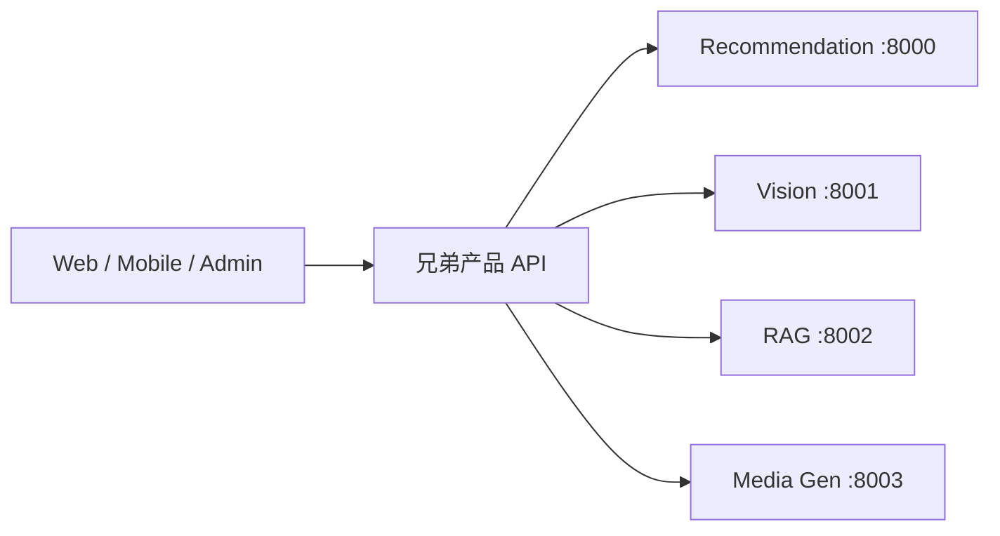

# 兄弟产品 — 旁路上游接入

← [用户手册首页](README.md)

本文将 Explore Chat（或其他 Spring API）作为**唯一客户端可见边界**，在本机回环调用 Explore ML。终端用户与前端不得直连 `:800x`。

原则见 [Guideline › Loopback Upstream](../Guideline.md)；术语见 [Glossary](../Glossary.md)。

---

## 接入概览

| 组件 | 角色 |
| ---- | ---- |
| 兄弟产品 API | 鉴权、编排、持久化；持有 upstream URL |
| Explore ML helpers | 本机推理 / 排序 / 审核 / 生成 |

---

## 默认 upstream URL

| 能力 | 环境变量（典型） | 默认 URL |
| ---- | ---------------- | -------- |
| 推荐 | `RECOMMENDATION_API_URL` | `http://localhost:8000` |
| 视觉 | `VISION_SERVICE_URL` | `http://localhost:8001` |
| RAG | `RAG_SERVICE_URL` | `http://localhost:8002` |
| 媒体生成 | `MEDIA_GENERATION_API_URL` | `http://localhost:8003` |

Explore Chat 中对应 `chat.upstreams.*`（或以各项目 `application.yml` / `.env` 为准）。

> 若本地仍配置 media-gen `http://localhost:3456`，请改为 `8003`，与本仓库默认端口一致。

---

## 代理约定

1. **只从服务端发起** HTTP 到 `localhost:800x`（或内网 sidecar）。
2. **超时与熔断**由兄弟 API 控制；helpers 不可用时产品主路径应可降级。
3. **密钥与模型路径**留在 helpers 的 `.env` / `LOCAL_MODELS_ROOT`，不要下发到浏览器。
4. **契约**以各服务 README 中的 `/api/v1/...` 路由为准；错误响应尽量走 AIP / RPC Status 形态（若该服务已接入）。

---

## 冒烟建议

| 步骤 | 操作 |
| ---- | ---- |
| 1 | 按 [本地启动指南](operator-setup.md) 拉起所需服务 |
| 2 | `curl` 各服务 `/health` |
| 3 | 在兄弟 API 配置 upstream 后跑一条业务路径（发帖审核、Feed 排序、RAG 问答、文生图等） |
| 4 | 故意停掉一个 helper，确认产品返回可理解错误而非挂死 |

---

## 相关文档

- [Python services layout](../developer/python-services.md)
- [C4 Deployment](../developer/c4-model/C4-Deployment.puml)
- [模型下载指南](model-download.md)
