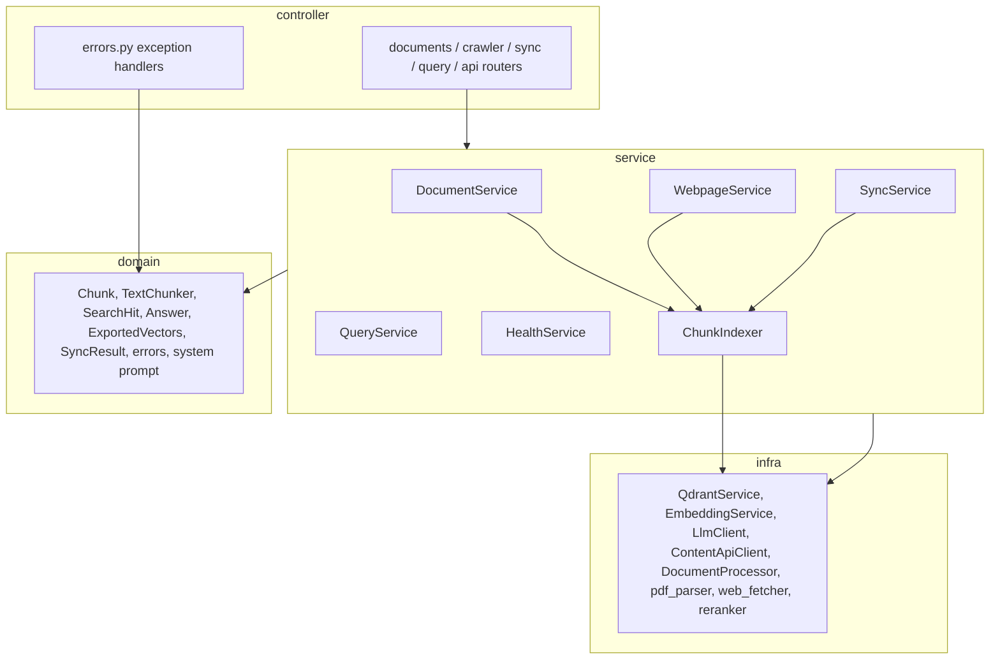

# RAG Service

Package `rag` in the single Explore ML app (port 8000): `module.py` /
`config.py` / `controller/` / `service/` / `domain/` / `infra/` / `tests/` /
`training/`. Setup and run commands:
[`python_ml/README.md`](../README.md).

Retrieval Augmented Generation (RAG) helper: index documents, webpages, posts
and comments into Qdrant, then answer questions from the retrieved chunks.

## Features

- **Documents**: upload and index PDF, HTML/HTM, Markdown, DOCX/DOC and TXT
  (max 50 MB)
- **Webpages**: scrape one URL, or crawl a list of URLs (up to 5 at a time;
  links are not followed)
- **Sync**: pull posts and comments from the content API at `CONTENT_API_URL`
- **Query**: answer a question from the top chunks, with optional sources
- **Streaming**: the same answer as server-sent events
- **Export vectors**: stored chunk vectors for client-side visualization
- **Rerank**: optional HTTP reranker rescores candidates before answering

## Tech Stack

- **Framework**: FastAPI (Python 3.11+)
- **Vector database**: Qdrant, embedded on disk by default
- **Embeddings and LLM**: Ollama (local) or OpenAI
- **Parsing**: PyMuPDF, BeautifulSoup, html2text, python-docx

## Quick Start

1. Start Ollama and pull the default models:

```bash
brew install ollama
ollama pull nomic-embed-text
ollama pull qwen3-coder:30b   # or point LLM_MODEL at a smaller model
ollama serve
```

2. Install and run the app from `python_ml/` (the RAG tests need only
   `rag/requirements.txt`):

```bash
cd python_ml
uv pip install -r requirements.txt --override overrides.txt
uvicorn main:app --port 8000
```

Qdrant needs no separate process: with `QDRANT_URL` empty the module stores
vectors under `QDRANT_PATH` (`python_ml/rag/data/qdrant`). To use a server
instead, start one and set `QDRANT_URL = "http://localhost:6333"` in
`config.py`:

```bash
docker run -d -p 6333:6333 qdrant/qdrant
```

## Configuration

Constants in [`config.py`](config.py); only `OPENAI_API_KEY` comes from
`python_ml/.env`.

| Constant                 | Description                                   | Value |
| ------------------------ | --------------------------------------------- | ----- |
| `UPLOADS_DIR`            | Saved uploads                                 | `python_ml/rag/uploads` |
| `QDRANT_URL`             | Qdrant server; empty means embedded           | `""` |
| `QDRANT_PATH`            | Embedded Qdrant directory                     | `python_ml/rag/data/qdrant` |
| `QDRANT_TIMEOUT`         | Qdrant client timeout (seconds)               | `30` |
| `QDRANT_VECTOR_SIZE`     | Unused by collections, which are created with 768 dimensions | `768` |
| `EMBEDDING_PROVIDER`     | `"ollama"` or `"openai"`                      | `"ollama"` |
| `EMBEDDING_MODEL`        | Ollama embedding model                        | `"nomic-embed-text"` |
| `OPENAI_EMBEDDING_MODEL` | OpenAI embedding model                        | `"text-embedding-3-small"` |
| `OLLAMA_BASE_URL`        | Ollama server                                 | `"http://localhost:11434"` |
| `LLM_PROVIDER`           | `"ollama"` or `"openai"`                      | `"ollama"` |
| `LLM_MODEL`              | Ollama chat model                             | `"qwen3-coder:30b"` |
| `OPENAI_LLM_MODEL`       | OpenAI chat model                             | `"gpt-4-turbo-preview"` |
| `LLM_TIMEOUT`            | Ollama request timeout (seconds)              | `120` |
| `CHUNK_SIZE` / `CHUNK_OVERLAP` | Chunk size and overlap (tokens)         | `256` / `50` |
| `CRAWLER_TIMEOUT`        | Webpage fetch timeout (seconds)               | `30` |
| `CONTENT_API_URL`        | Content API base URL for sync                 | `"http://localhost:3000"` |
| `RERANK_ENABLED`         | Call the rerank sidecar; skipped if it is down | `True` |
| `RERANK_URL`             | Rerank sidecar base URL                       | `"http://127.0.0.1:8091"` |
| `RERANK_TIMEOUT`         | Rerank request timeout (seconds)              | `30.0` |

### Rerank sidecar

The reranker is a separate HTTP server, not part of this repo. It must answer
`POST {RERANK_URL}/rerank` with `{scores}`, and loads
`$LOCAL_MODELS_ROOT/rerank/models/Qwen3-Reranker-8B`. Download the weights
with the [model download guide](../../docs/user-guide/model-download.md) and
start your sidecar on port 8091, or set `RERANK_ENABLED = False`.

### Fine-tuning

`training/` holds:

- `train_embedding.py` — local embedding fine-tune
- `to_ollama.sh` — import a GGUF into Ollama
- `train_reranker.py` — LoRA reranker job on Hugging Face Jobs
- `eval_retrieval.py` — recall@k / MRR against the running app
- `train_sft.py` — QLoRA SFT of Qwen3-8B on Hugging Face Jobs
- `eval_answers.py` — compare answers with an LLM judge

After switching `EMBEDDING_MODEL`, re-index every document. For the chat
model, `to_ollama.sh <dir> rag-llm-ft Q4_K_M` registers the merged model and
`LLM_MODEL=rag-llm-ft` selects it. See the
[fine-tuning guide](../../docs/user-guide/fine-tuning.md).

> Keep chunks within the embedding model's context (~2000 characters for
> `nomic-embed-text`).

## API Endpoints

All resource routes are under `/api/v1`. Errors return `{"detail": "..."}`:
400 for invalid input (unsupported or empty file, bad `page_token`), 404 for a
missing document, 503 when the LLM is unavailable, the upstream status when a
fetched URL or the content API fails, and 422 for schema validation.

### Documents

```
POST   /api/v1/documents           Upload and index a file (multipart "file"), 201
GET    /api/v1/documents           List documents (page_size 1-100, default 20; page_token)
GET    /api/v1/documents/{id}      Get one document
DELETE /api/v1/documents/{id}      Delete a document and its chunks, 204
```

Upload response: `{id, filename, file_size, content_type, status, chunks_count}`.
List response: `{documents: [{id, filename, source_url, content_type,
file_size, status, chunks_count, created_at, updated_at}], next_page_token}`.

### Webpages

```
POST   /api/v1/webpages:scrape     {url} -> {id, url, title, content_length, chunks_count, status}
POST   /api/v1/webpages:crawl      {urls: [1-50]} -> {total_urls, successful, failed, results: [...]}
```

Only `text/html` and `text/plain` pages are accepted, and text is truncated to
100,000 characters. `max_depth` and `include_subpages` are accepted but
ignored. A failed URL in a crawl gets `status: "error: ..."`.

### Sync

```
POST   /api/v1/posts:sync          {post_ids?, limit (1000), since_hours?}
POST   /api/v1/comments:sync       {comment_ids?, post_ids?, limit (1000)}
POST   /api/v1/resources:sync      posts then comments, limit 1000 each
```

Each returns `{total, successful, failed, skipped, errors, duration_ms}`;
`resources:sync` returns `{posts, comments, status: "completed"}`. Records
without content count as skipped.

### Query

```
POST   /api/v1/documents:query           Answer with sources
POST   /api/v1/documents:streamQuery     Answer as server-sent events
POST   /api/v1/documents:exportVectors   {collection?, limit (1-10000, default 2000)}
GET    /api/v1/collections               {collections: [info per collection]}
```

Query request: `query` (1-2000 chars), `collection` (one of `documents`,
`posts`, `comments`, `webpages`; all when omitted), `top_k` (1-20, default 5),
`include_sources` (default true). `filter_metadata`, `temperature` and
`stream` are accepted but not used yet.

Query response: `{answer, sources: [{id, text, score, metadata}], query,
collection_used, total_chunks_searched, generation_time_ms}`. Source text is
cut to 500 characters.

The stream sends one `data: <token>` frame per token and ends with
`data: [DONE]`.

Export response: `{dimension, points: [{id, vector, text, metadata}]}`, text
cut to 500 characters, `metadata.collection` set, and `dimension` 0 when
nothing is stored.

### Health

RAG reports `{status: ok | degraded, qdrant, embeddings}` in the app's
`GET /health` (see [`python_ml/README.md`](../README.md)).

## Usage Examples

```bash
# Upload
curl -X POST "http://localhost:8000/api/v1/documents" -F "file=@document.pdf"

# Scrape
curl -X POST "http://localhost:8000/api/v1/webpages:scrape" \
  -H "Content-Type: application/json" \
  -d '{"url": "https://en.wikipedia.org/wiki/Black_Myth_Wukong"}'

# Query one collection
curl -X POST "http://localhost:8000/api/v1/documents:query" \
  -H "Content-Type: application/json" \
  -d '{"query": "What did users say about this post?", "collection": "comments", "top_k": 3}'

# Stream
curl -N -X POST "http://localhost:8000/api/v1/documents:streamQuery" \
  -H "Content-Type: application/json" \
  -d '{"query": "Summarize the key points", "collection": "webpages"}'

# Export vectors
curl -X POST "http://localhost:8000/api/v1/documents:exportVectors" \
  -H "Content-Type: application/json" -d '{"limit": 500}'
```

Interactive docs: <http://localhost:8000/docs> (Swagger) and
<http://localhost:8000/redoc>.

## Architecture



Each service is a class built by an `@lru_cache` `get_x_service()` function
and injected into routes with `Annotated[XService, Depends(get_x_service)]`.
Request and response models live in the controllers; the domain uses plain
dataclasses.

## Data Flow

```text
Upload / scrape / sync -> parse -> TextChunker -> ChunkIndexer
                          (embed in batches of 10) -> Qdrant upsert

Query -> embed question -> search each collection (top_k)
      -> keep top_k * 3 candidates -> rerank (optional) -> top_k hits
      -> system prompt with sources -> LLM -> answer + sources
```

## Development

```bash
cd python_ml
pytest -q rag/tests           # 8 test files
uvicorn main:app --reload
```

Tests cover the chunker, document parsing, query models, rerank scoring,
export vectors, route paths, fine-tuning helpers and the services through the
FastAPI app (`test_services_api.py`, with `app.dependency_overrides`). CI runs
this suite on every pull request.

## License

MIT
